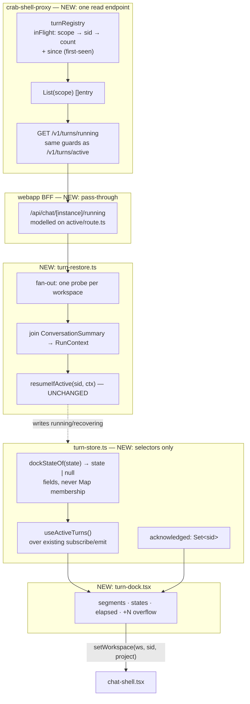

# background-turn-dock — Design

Read `spec.md` first. This document covers only *how*: what is added where, the two
orderings that are load-bearing, and the hazards found while reading the existing code.

## Shape of the change



Existing code that is **read but not modified**: `runTurn`, `recover`, `consumeStream`,
`transcriptLength`, `resumeIfActive`, `stopTurn`, `setPainter`, `clearCompleted`,
`turnRegistry.Active`, `turnRegistry.Current`, `handleTurnsActive`.

## Proxy

### `internal/httpapi/turn_registry.go`

The counted set becomes a counted set with a birthday:

```go
type turnEntry struct {
    count int
    since time.Time
}
// scope -> sessionID -> entry
inFlight map[memgraph.Scope]map[string]turnEntry
```

- `Begin` sets `since` **only when creating** the entry (spec FR-P6). The header comment
  already explains why counts are re-entrant; the same paragraph is where the
  don't-reset rule belongs.
- The `end` closure decrements and deletes at zero, unchanged in behaviour — deleting the
  entry drops the timestamp with it.
- `Active` and `Current` read `.count` and are otherwise untouched (FR-P9).
- `List(scope) []struct{SessionID string; Since time.Time}` returns entries with
  `count > 0`, sorted by `Since` ascending so the dock's order is stable across probes
  without the client sorting. Deliberately not built on `Current` (FR-P5) — the comment
  should say so, because `Current`'s refuse-when-ambiguous rule is the trap.
- A clock is needed for tests. Check whether `Server`/`turnRegistry` already has an
  injectable one before adding a field; if not, a package-level `now = time.Now` var
  overridden in tests matches the lighter end of this codebase's habits.

### `internal/httpapi/handlers.go`

`mux.HandleFunc("GET /v1/turns/running", s.handleTurnsRunning)` next to the `active`
registration at line 284, and `handleTurnsRunning` next to `handleTurnsActive` at 1581.

The handler is `handleTurnsActive` minus the `session_id` read: `resolveAgent` →
`Resolver.Resolve(ProfileHeader)` → `tenant_id`/`subs_acc_id` UUID parse → the
`ident.Profile.AccID == subsAccID` 403 → build `docker.WorkspaceKey` → `scopeOf(key)` →
`s.turns.List(...)`. Guard `s.turns != nil` exactly as `active` does.

Response: `{"turns": [{"session_id": "...", "since": "2026-08-18T14:02:11Z"}]}`, always a
present array (FR-P8) — a Go `nil` slice marshals to `null`, so initialise it.

**No docker package call.** `resolveAgent` is a config lookup with a token comparison
(`handlers.go:480`) and `handleTurnsActive` reaches nothing else; keeping that true is
FR-P7, and it is what makes the client's fan-out affordable.

## Webapp BFF

`app/api/chat/[instance]/running/route.ts` is `active/route.ts` with `session_id` dropped
from the required set and the response mapped instead of coerced. Everything else — the
`isInstance` check, `getSession`, the 401 → `clearSession`, `MyceliumConnectivityError` →
502, `upstreamError` — is copied verbatim, including the comment explaining why `project`
is not forwarded.

## Store: `app/chat/turn-store.ts`

Three additions, no edits to existing functions.

**`dockStateOf(state)`** — returns the FR-S2 discriminator or `null` for "not docked", so
membership and label are one decision rather than two that can disagree. Exported for
isolated testing. The test that matters is the negative one: an entry that has
been through `clearCompleted` (blank bands, `running: false`, `error: null`) must **not**
be docked, because that entry is never deleted from `turns` (DEC-8).

**`useActiveTurns()`** — `useSyncExternalStore(subscribe, snapshot, () => EMPTY_LIST)`.

The hazard is FR-S3. `emit()` fires on every reveal tick — `REVEAL_MAX_STEPS = 60` per
reply — and `useSyncExternalStore` compares snapshots by reference. A naive
`Array.from(turns).filter(...).map(...)` allocates a new array each tick and re-renders
the dock ~60 times per reply for fields it does not display. So the snapshot is memoized
at module scope: build the candidate list, derive a cheap signature from only the fields
the dock renders (sid, a state discriminator, `recoveringSince`, `error`), and return the
previous array when the signature is unchanged. `revealed`/`buffered` are deliberately
outside the signature — the dock shows a state, not the reply text.

**`acknowledged: Set<string>`** at module scope, with `acknowledgeTurn(sid)` and a clear
inside the docked-membership path when a turn goes `running` again (FR-S5). It does not
touch `error`/`errorDetail` — DEC-9, and the reason is in `clearCompleted`'s own comment.

## Restore: `app/chat/turn-restore.ts` (new)

```
workspaces (from the shell's existing useWorkspaceGroups)
  └─ for each, in parallel:
       GET /api/chat/{r}/running?tenant_id&subs_acc_id     → [{session_id, since}]
       listConversations(workspace)                         → ConversationSummary[]
       join on id; skip unmatched ids (FR-R2)
       for each match: resumeIfActive(sid, {workspace: {...ws, p: project}, project, onUnauthorized})
```

**The ordering hazard, restated because it will be optimised away by accident (FR-R3).**
`resumeIfActive` reads the transcript baseline *before* probing `/active`, and its own
docblock explains why: a turn that lands during the probe would otherwise be baselined
with its reply already counted, never grow, and report `turn_lost` after eleven minutes.
The listing probe here happens *earlier still*, so passing `active: () => true` puts the
sequence back into exactly the broken order. The listing discovers **candidates**; every
candidate then runs the unchanged `resumeIfActive`. The cost is one extra round-trip per
restored conversation, and it buys the correctness the predecessor feature paid for.

Reuse `probes.cancelled` for the unmount case — it already exists for this reason.

Idempotence (FR-R4) is a module-scope `restored` flag, not a React ref: the shell can
remount (`useWorkspaceGroups` re-fetch, locale switch) and the fan-out must not repeat.
`resumeIfActive`'s own `getTurn(sid).running` guard is the second line of defence, not the
first.

## UI: `app/chat/turn-dock.tsx` (new)

Rendered by `chat-shell.tsx` inside the chat column, as a sibling of `ChatView` — not
inside it. `ChatView` is keyed on `${t}|${s}|${r}` (`chat-shell.tsx:303`) and unmounts on
a workspace switch; the dock's whole purpose is to outlive that.

- Segments: flex, `flex: 1` each, capped by FR-U3 (4 desktop / 3 mobile) with a `+N`
  control opening a list. The shell already tracks `desktop` via
  `matchMedia("(min-width: 768px)")` — pass it down rather than adding a second listener.
- Colour: `--accent` / `--accent-soft` / `--accent-fg`. `--brand` is the violet and is not
  this feature's blue.
- State → source field: the five-row table in spec FR-S2, with its bottom-up precedence.
  Implement the mapping **once**, next to `isDocked`, and have the dock render from the
  returned discriminator — a predicate in the store and a `switch` in the component that
  each decide membership separately will drift, and the failure mode is a docked chip with
  no label.
- Order: oldest first, matching `List`'s server sort (FR-U3), so a probe result and a store
  update cannot reshuffle the segments.
- Elapsed: **two clocks, both existing** (spec DEC-12). In-session, `useElapsed(lastEventAt)`
  — quiet-for, past `SILENCE_GRACE_MS`, identical to what `TurnProgress` shows, so the chip
  and the band can never disagree. Restored, the server's `since` — total duration, shown
  immediately. There is no turn-start field in `TurnState` and DEC-1 forbids adding one in
  `runTurn`; none is needed, because FR-12's readout was never a total duration. `useElapsed`
  and `formatElapsed` come from `turn-progress.tsx`; `useElapsed` is currently module-private
  and needs exporting.
- **A restored chip must not read `recoveringSince`.** `resumeIfActive` calls `recover()`,
  which patches `recoveringSince: Date.now()` (`turn-store.ts:549`) — so a restored entry
  reading the store would display a confidently wrong fresh duration. This is the concrete
  reason DEC-4 puts a timestamp on the server.
- Each segment's own second-ticking interval, not a store emission. FR-S3 keeps time-varying
  fields out of the snapshot signature on purpose, so an advancing counter cannot come from
  `emit()`. `useElapsed` already owns exactly this interval-per-band pattern.
- *unsent* (spec DEC-13) is a real state and the trap is visual, not structural: `parkFlush`
  only clears the timer, so the burst sits in `pending` unsent until the member returns and
  types. Nothing is running — it must not borrow the spinner.
- Motion: any pulse goes through the `prefers-reduced-motion` guard already in
  `globals.css`; `turn-progress.tsx` is the precedent to copy, not to re-derive.

### Hazard: navigating to a docked project conversation

`setWorkspace(workspace, sid)` **deletes `p`** on purpose (`fragment.ts:214`): a project
belongs to one agent, so carrying it into a different workspace would name a directory
nobody created. But a docked entry may be a project conversation in another workspace, and
FR-U6 has to land on workspace + project + sid **in one hash write** — doing it as
`setWorkspace` then `setFragmentProjectSid` produces an intermediate hashchange pointing at
the right workspace with the wrong (absent) project, and every per-project fetch on that
frame addresses the agent root.

Fix: an optional third parameter on `setWorkspace(workspace, sid, project?)` that sets `p`
when given and deletes it otherwise. Default behaviour and every existing caller are
unchanged, and the deliberate `params.delete("p")` stays as the else branch with its
comment intact.

### Hazard: stacking and the composer

FR-U9. `RestartBanner` renders at `chat-shell.tsx:302`, above the chat column. The
composer sits at the bottom of `ChatView`. On mobile the dock goes *above* the composer in
document order (DEC-11) rather than floating over it, which sidesteps the keyboard
collision instead of managing it. Define the z-index once, in the dock, and assert the
no-overlap requirement in a layout test rather than by eye.

## i18n

New keys in both `en` and `pt` in `lib/i18n/chat.ts` (FR-U10): the four state labels, the
`+N` overflow label, the workspace/project qualifier, and the elapsed format. The existing
`recovering` string is the tonal reference — it tells the member what is happening and
that the agent is still working, in one sentence.

## Diagrams

`mermaid-studio` is not installed here, so the flowchart above is an inline fence. If
richer diagrams (SVG/PNG export, validation, theming) become useful for this feature,
installing it would be worth it.
