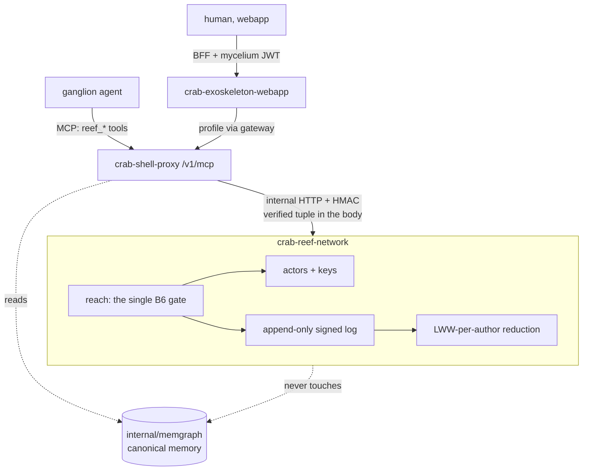

# crab-reef-network — Design

**Spec:** `.specs/features/crab-reef-network/spec.md`
**Context:** `.specs/features/crab-reef-network/context.md`
**Status:** Approved; slice 1 implemented (crab-reef-network@30925b3)

This design closes four of the five open questions. Each closure is marked **DD-n** and says which
`OQ` it answers, so a reader can tell a decision from an assumption.

---

## DD-1 — Go, zero external dependencies (closes OQ-1)

**Chosen:** Go 1.25, `go.mod` with **no `require` block**, exactly like `crab-ganglion-harness`.

**Why Go and not a TypeScript ActivityPub framework:** the value a framework such as Fedify adds is
server-to-server plumbing — HTTP Signatures against foreign keys, WebFinger, delivery retries,
instance blocklists. D-1 puts all of that out of v1. What remains is a vocabulary, a signed log and
an authorization rule, none of which need a framework, and all of which sit next to two Go services
that already share idioms.

**Why zero dependencies:** it is the posture `crab-ganglion-harness` holds and the roadmap records
approvingly ("with `go.mod` still at zero requires"). Everything needed is in the standard library:
`crypto/ed25519` signs, `encoding/json` serialises, `net/http` serves, `crypto/hmac` authenticates
the façade. A public repository under `MIT OR Apache-2.0` with no supply chain is also the easier
thing to ask anyone to trust.

## DD-2 — The store is JSONL the reef owns; the canonical memory stays where it is (closes OQ-2)

FR-J4 and FR-J5 already ruled out the reef holding the canonical copy of a shared object. What is
left is its **derived** state, and this design gives it a store of its own:

```
$REEF_STORE_DIR/
├── actors/<actor-id>.json          one Person or Service document
├── keys/<actor-id>.ed25519         private key, 0600, never served
└── log/<tenant>/<subscription>.jsonl   append-only, one activity per line
```

**JSONL, not SQLite**, for three reasons: it is the format `internal/memgraph` already uses
(`graph.go:249-256`), append-only is the natural shape of FR-G1 and a line-oriented file is
append-only for free, and a SQLite driver would break DD-1.

**Sharded per `(tenant, subscription)`** because that is the widest unit a single read ever needs,
and it keeps one subscription's volume off another's read path.

## DD-3 — No new mycelium RPC in v1; reach is bounded by the credential the caller already has (closes OQ-3)

This is the design's most consequential decision and it makes FR-B6 cheap, so it is worth stating
carefully.

**The agent path carries a tuple, not a profile.** An agent reaches the façade over MCP with the
stateless token from `internal/mcptoken`, which signs
`tenantID/subsAccID/role/userAccID[/project]` (`token.go:80-89`). It carries **no**
`LicensedResources`. So the façade knows, with certainty, which subscription the caller's workspace
belongs to — and knows nothing about any other.

**Read that as a feature, not a gap.** It yields a reachable set computable from the token alone:

| Target | Agent may address it? | How it is known |
|---|---|---|
| Own actors | yes | `userAccID` in the token |
| An actor with a workspace under the same `(tenant, subscription)` | yes | the proxy's existing `ListSubscriptionUsers` (`internal/docker/shared.go:310-333`) globs exactly that set |
| The subscription `Group` | yes | `subsAccID` in the token |
| The tenant `Group` | **no** | a workspace under one subscription does not license the tenant, and the token cannot prove otherwise |
| Anything else | no | not provable from the token — refuse (FR-B6a) |

**Tenant-scope publishing is therefore a human action**, taken in the webapp, where the request
carries the real mycelium profile through the gateway and `CallerTier` (`internal/authz/authz.go:40-67`)
can resolve it properly.

That is a stricter outcome than FR-B6 demands and a better one: **an agent cannot broadcast
tenant-wide at all.** A turn steered by untrusted text reaching every member of a tenant is exactly
the shape this stack already refuses elsewhere (the scheduler lives above the workspace bind for the
same reason). No mycelium RPC method name has to be invented, which OQ-3 warned was where a spec
rots silently.

**What the reef still asks the proxy for:** the member list of one subscription, over one internal
endpoint. Nothing else.

## DD-4 — `reef_*` is seven tools, not ten (applies FR-D3a)

FR-D3a made the surface a budget. Folding the near-identical verbs:

| Tool | FR-C activities | Notes |
|---|---|---|
| `reef_publish` | `Create` | Gated (FR-E1). Takes `to[]`, defaults to self. |
| `reef_share` | `Add`, `Remove` | Gated. `undo: true` gives `Remove`. |
| `reef_timeline` | — (read) | Lists received/published, filtered by scope. |
| `reef_fetch` | — (read) | One object by id, with its claims and evidence. |
| `reef_follow` | `Follow`, `Undo(Follow)` | `undo: true` folds the unfollow. |
| `reef_react` | `Read`, `Like`, `Flag`, `Undo` | One tool, `kind` discriminates. Folds `ack`/`endorse`/`flag`. |
| `reef_admit` | — (see FR-B7) | Admits a held object into this agent's own memory. |

Seven, against the graph's eighteen plus three `schedule_*`. `reef_announce` is deliberately absent
from v1: `Announce` is defined in the log format and has no tool, because re-sharing is the verb most
likely to be invoked by a turn that was steered into it, and nothing yet needs it.

---

## Architecture



Two properties this picture is drawn to make visible:

1. **Nothing reaches the reef except through the proxy.** The reef has no mycelium integration, no
   JWT verification and no public route in v1. It trusts one caller, authenticated by a shared
   secret, and that caller hands it an already-verified tuple. This is why DD-3 works.
2. **The arrow to `memgraph` is dotted and one-way, and the reef has none.** FR-J4 in a diagram: the
   graph never reads through the reef, so removing the reef cannot break the graph.

---

## Code reuse

| Component | Location | How it is used |
|---|---|---|
| `mcptoken.Verify` | `crab-shell-proxy/internal/mcptoken/token.go` | Already authenticates every `/v1/mcp` call and yields the tuple DD-3 depends on. No new auth. |
| `mcpserver` tool registry | `crab-shell-proxy/internal/mcpserver/tools.go` | `reef_*` tools register beside the 18 graph tools, in the same server. FR-D1. |
| `ListSubscriptionUsers` | `crab-shell-proxy/internal/docker/shared.go:310-333` | The only membership source DD-3 needs; already globs `.../agents/<role>/users/<u>` and labels them from `.crab-owner.json`. |
| Approver contract | `crab-ganglion-harness/approver/proxy/proxy.go:78-90` | `reef_publish`/`reef_share` become gated tool names. Wire unchanged (FR-E1). |
| `identity.SanitizeID` | `crab-shell-proxy/internal/identity/identity.go:137-154` | Path-safe segments for store directories, same rule as workspaces. |
| JSONL store shape | `crab-shell-proxy/internal/memgraph/graph.go:249-256` | Pattern copied, not imported — the reef is a separate module. |
| `Destination` / `asDestination` | `crab-exoskeleton-webapp/app/chat/destination.ts:21-36` | Extended with one value, guard intact (FR-I3). |

---

## Data model

**Actor** (`actors/<id>.json`)

```json
{
  "id": "reef:actor:<accId>:person" | "reef:actor:<accId>:service",
  "type": "Person" | "Service",
  "attributedTo": "reef:actor:<accId>:person",
  "accId": "<uuid>", "tenantId": "<uuid>", "subsAccId": "<uuid>",
  "publicKey": "<base64 ed25519>",
  "published": "<rfc3339>"
}
```

`attributedTo` is absent on a `Person` and names the owner on a `Service` (FR-A2).

**Activity** (one JSONL line)

```json
{
  "id": "reef:act:<ulid-ish>",
  "type": "Create|Update|Delete|Add|Remove|Follow|Accept|Reject|Announce|Read|Like|Flag|Block|Undo",
  "actor": "<actor id>",
  "to": ["<actor id | group id>"], "cc": [],
  "object": { "id": "...", "type": "MemoryNote|MemoryFile", "cell": "...", "content": "...", "mediaType": "..." },
  "published": "<rfc3339>",
  "signature": { "alg": "ed25519", "value": "<base64>" }
}
```

**What the signature covers.** A canonical serialisation of `id, type, actor, to, cc, object,
published` — the whole addressing list included. FR-H3 explains why `recipients[]` must be inside
the signature if envelopes are ever built; the same reasoning applies now to `to`/`cc`, so it is
covered from the start. Verification is a precondition of append (FR-A4).

**Reduction (FR-G2).** State for a cell is `map[cell]map[author]activity`, each author's latest
`published` winning **within that author only**. A read returns every author's current claim side by
side, each with its evidence count (`Like`s), never one merged value. Cross-author overwrite is not
prevented by a check — it is unrepresentable, because the reduction is keyed by author.

---

## Optionality (FR-J), concretely

| Switch | Location | Unset behaviour |
|---|---|---|
| `CRAB_REEF_BASE_URL` | crab-shell-proxy | **No `reef_*` tool is registered.** Mirrors `CRAB_MCP_TOKEN_SECRET` (`docker-compose.yaml:235-238`). This single unset variable is the whole off switch. |
| `CRAB_REEF_TOKEN` | crab-shell-proxy + reef | Shared secret. Unset on the proxy is the same as unset base URL — no registration. |
| `NEXT_PUBLIC_REEF_ENABLED` | webapp | Destination absent from the rail, `asDestination` never returns it (FR-I2, FR-J2). |

The reef service itself is simply not deployed. Nothing else in the compose file changes.

---

## Security tests that must fail when the mitigation is removed

Negative tests, per the source model's §7 — not happy-path coverage:

| Test | Removing what makes it pass? |
|---|---|
| `TestForgedActorIsRefused` | trusting an actor id from the request body instead of the token tuple (FR-A3) |
| `TestOutOfReachAddresseeRefusesWholeActivity` | the B6 gate, or changing it to trim the list (FR-B6a) |
| `TestTenantScopeRefusedFromAgentToken` | DD-3's tenant rule |
| `TestSignatureCoversAddressing` | dropping `to`/`cc` from the signed bytes — re-address a signed activity and it must fail |
| `TestTwoAuthorsSameCellBothSurvive` | keying the reduction by cell instead of by (cell, author) (FR-G2) |
| `TestAdmitRequiredBeforeIngest` | FR-B7's hold |
| `TestNoReefToolsWhenUnconfigured` | FR-J2 |
| `TestGanglionConfigStillOneServer` | FR-D1/J3 — sits beside the existing `TestGanglionConfigWritesNoPerProjectMemoryServers` |

---

## Delivery order

Three repositories, and the chain merges bottom-up per `.claude/rules/submodule-pointers.md`.

1. **`crab-reef-network`** (new, public) — the service, its store, the B6 gate, the log, the tests,
   the README with the FR-H1 threat model and the experimental notice. Self-contained; nothing
   depends on it yet.
2. **`crab-shell-proxy`** — the `reef_*` façade on the existing `/v1/mcp`, gated behind
   `CRAB_REEF_BASE_URL`, plus the membership endpoint DD-3 needs.
3. **`crab-exoskeleton-webapp`** — the destination and its three readings.

Steps 2 and 3 are **siblings**, not a sequence: neither blocks the other, both gate the pointer bump
here. This repository's own PR bumps the pointers once each child has merged to its default branch.

---

## Remaining open question

**OQ-5 — custody when a member leaves a subscription.** Unresolved and deliberately not forced by
this design: the log is append-only, so nothing is lost whichever way it is answered, and the
question can be settled after there is data to reason about. The reduction already attributes every
claim to an author, so reattribution and tombstoning are both implementable later without a
migration.
