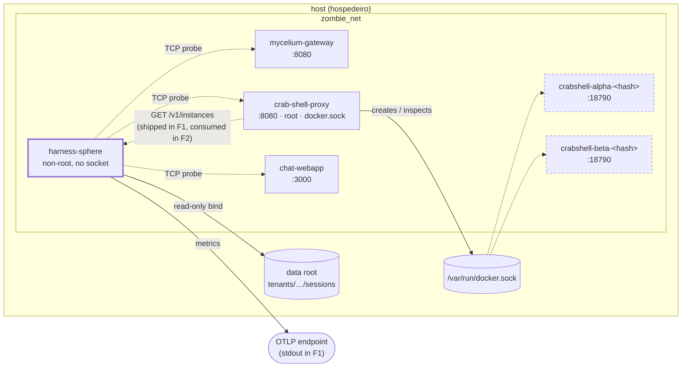
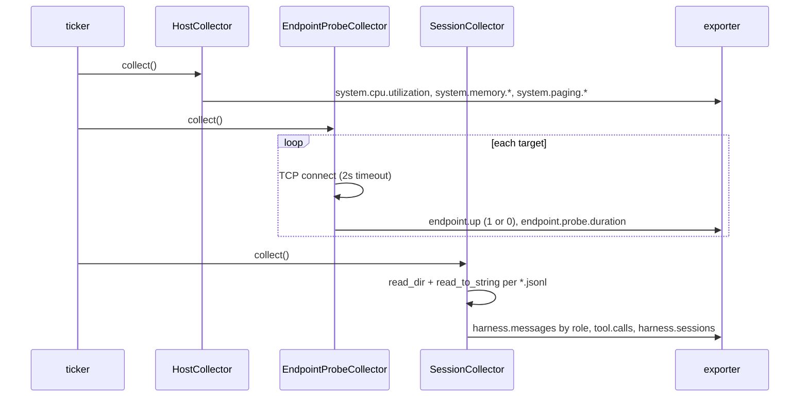

# harness-sphere-integration — Design

**Status:** DESIGN. Settles OQ-5, which `spec.md` left open as the only F1 requirement
whose shape was genuinely undecided. Everything else here is the shape the requirements
already imply.
**Date:** 2026-09-07.

## Topology



Dashed picoclaw boxes are **not observed in F1** (spec Non-goals). They are drawn because
the whole point of the placement decision is that they are *reachable* from where
harness-sphere sits — which is what F2 will use.

## DEC-15 — `GET /v1/instances` gets its own read-only credential (settles OQ-5)

**The rejected option first, because it is the one that looks obvious.** Reusing
`resolveAgent` would mean handing harness-sphere an agent's `ResolvedToken`. That token is
not a read scope — it is the credential that gates *every* authenticated route on the
proxy, including `POST /v1/chat/completions`.

And it is load-bearing in a way that is easy to miss. The caller's identity arrives in
`x-mycelium-profile`, and the proxy **does not verify it**:
`SDKResolver.Resolve` calls `mycelium.DecodeAndDecompressProfileFromBase64`
(`internal/identity/identity.go:67`) — base64 → zstd → JSON, a transport encoding with no
signature check. The header is unauthenticated data that the proxy trusts *because
mycelium injected it*, and `resolveAgent`'s bearer-token check
(`internal/httpapi/handlers.go:500`) is what makes that trust safe: it is the thing that
stops a caller who reached the proxy directly on `zombie_net` from asserting whatever
`accId` they like.

So an agent token in the watcher's environment does not widen a read surface. It hands a
telemetry component the one secret that gates chat as any user in any tenant. **A
monitoring service must not be able to send a message as a member.**

**The second reason the reuse does not fit**, and the one that surfaced first: the endpoint
is inherently cross-agent — it lists every workspace of every agent — while `resolveAgent`
resolves exactly one agent from `x-mycelium-service-name` and validates that agent's token.
There is no principled answer to "which agent's token authorizes a list spanning all
agents". This is where the `background-turn-dock` FR-P2 precedent stops applying: that
endpoint reproduces `resolveAgent` verbatim *because it is scoped to one agent*.

**Decision.** A distinct credential, configured on the proxy and given only to
harness-sphere, authorizes `GET /v1/instances` and nothing else. Concretely:

- A new config value with a `CRAB_*` env override, absent by default.
- **When it is unset, the route is not registered at all.** Not "registered and always
  401" — absent. A deployment that has not opted in has no new surface, and a
  misconfiguration cannot leave an unauthenticated topology dump reachable.
- It authorizes only this route. It is never accepted by `resolveAgent` and never
  substitutes for an agent token.
- Constant-time comparison, matching how the agent token is already compared in spirit;
  the value is a secret and a timing oracle on a topology endpoint is free to exploit from
  inside `zombie_net`.

**Accepted cost, stated plainly:** this is the first credential on the proxy that is not an
agent's, so it is a new thing to provision and rotate, and the stack has no rotation
automation (`PROJECT.md` lists it as explicitly out of scope). That is a real cost and it
is smaller than the alternative, which is a watcher that can impersonate members.

**Rejected for a different reason: mounting the socket read-only on harness-sphere.**
There is no read-only Docker socket. The API is one endpoint with full authority; a
`:ro` bind stops the *file* being written, not `POST /containers/create`. It would have
made this decision moot by making the watcher root-equivalent, which is precisely what
spec DEC-3 refused.

## DEC-16 — The endpoint reports the union of two surfaces, computed on the proxy

FR-P5 requires that a provisioned-but-never-started workspace be reported explicitly rather
than omitted. The proxy is the only place that can compute that union cheaply, because it
already does both halves for its own boot reconciliation:

- `docker.List(crab-shell.managed=true)` → live containers, tuple from the six labels
  (`internal/docker/manager.go:21-28`).
- `existingWorkspaces`, which globs
  `tenants/*/subscriptions/*/agents/<role>/users/*` → provisioned workspaces
  (`internal/docker/reconcile.go`).

Each entry therefore carries a state drawn from a closed set — running, stopped,
provisioned-without-container, container-without-directory — rather than a raw Docker
status string passed through. A closed set is what lets a consumer treat the fourth case
as the anomaly FR-D4 will require, instead of pattern-matching engine strings.

**This is a read-out over existing machinery, not new machinery.** If an implementation
task finds itself adding a registry, a cache, or a background scan to serve this endpoint,
the task has misread the design: both halves are already computed on demand elsewhere in
the same package.

## DEC-17 — The Dockerfile is a two-stage static build, and it lives upstream

The image is built in `harness-sphere`, not here (spec FR-C6), so that `release.yml` and
this stack's compose consume the same artifact definition.

- Builder stage on the channel `rust-toolchain.toml` names, which is `stable` — **not a
  pin**. It was exercised at 1.96.0 during FR-V1's experiment, and a reproducible release
  image should name an explicit version in the Dockerfile rather than inherit whatever
  `stable` resolves to on build day.
- `--features otlp`; `ingest` and `prometheus` off (FR-C6).
- Runtime stage: a minimal base, a non-root user (FR-C2), the binary and nothing else.
- The release profile is already tuned for this (`opt-level = "z"`, `lto`, `strip`), and
  `panic = "unwind"` is kept **deliberately** — the workspace `Cargo.toml` says so, because
  the resilience contract depends on `catch_unwind`. **A task that sets `panic = "abort"`
  to shrink the binary breaks the Critical/Optional isolation the whole design rests on.**

## DEC-18 — Compose wiring, and the two things that must not be added

```
harness-sphere:
  build: ./crab/harness-sphere
  networks: [zombie_net]
  restart: unless-stopped
  user: <non-root>
  volumes:
    - ${CRAB_HOST_DATA_ROOT:-...}:/data:ro
  environment:
    HARNESSSPHERE_EXPORTER: ${HARNESS_SPHERE_EXPORTER:-stdout}
```

No `ports`. No `depends_on`. No `/var/run/docker.sock`. No `/proc` or `/sys`.

`depends_on` is absent by design, not by omission (FR-C5): `EndpointProbeCollector::probe()`
never touches the network — it returns `Ready` when the target list is non-empty
(`crates/collectors/src/probe.rs:44`) — and reachability is decided per tick inside
`collect()`, which emits `up = 0` and returns `Ok`. Ordering the watcher behind the health
of the things it watches would suppress exactly the signal it exists to produce.

The data-root bind is `:ro` and is the same host path the proxy already uses. Note the
asymmetry that makes this safe: the proxy writes that tree as root; harness-sphere reads it
as a non-root user and never writes.

## DEC-19 — Config precedence: TOML committed, secrets by env

`config.zombie-crab.toml` is committed in the submodule and holds intervals, probe targets
and the session path. The exporter endpoint and the FR-P credential arrive by environment
(`HARNESSSPHERE_EXPORTER` already exists upstream as an override). No secret is written
into a tracked TOML — the upstream `config.example.toml` already states this rule for the
Prometheus token, and it is kept even though that field is being configured empty here.

## Sequence: what one tick looks like



The `SessionCollector` box is drawn with its full re-read on purpose: it is what FR-V3
measures, and it is the shape F2's DEC-13.4 replaces.

## What this design deliberately does not decide

- **Where per-container CPU/memory comes from** (spec OQ-2 / F2 OQ-6). Untouched here.
- **The backend** (spec OQ-1). `stdout` in F1.
- **Response field names and the OpenAPI entry for `/v1/instances`.** Ordinary
  implementation detail, settled in the proxy PR against its own conventions — the proxy
  serves `/doc/openapi.json` for mycelium's tool discovery, and the new route needs to
  appear there consistently with the rest.
