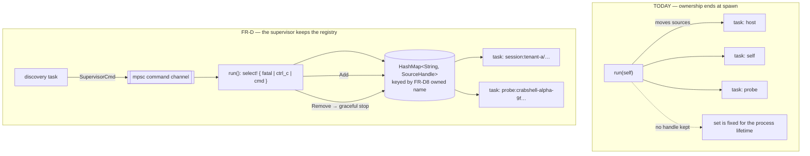
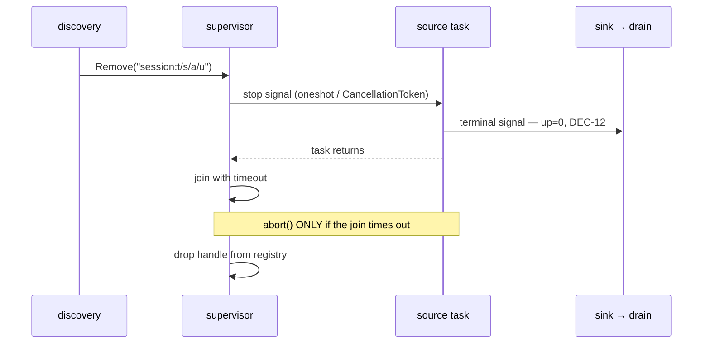
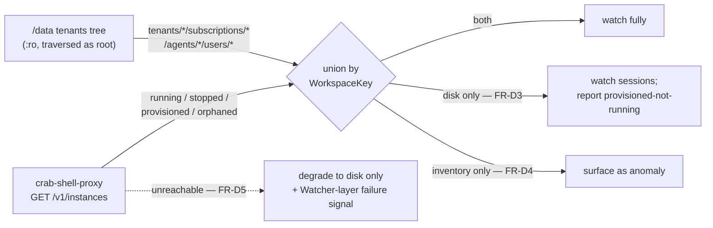

# harness-sphere-zombie-crab-scope — Design

**Status:** DESIGN. Covers the **unimplemented half** of F2 — dynamic discovery (FR-D) and
session collection (FR-S). The scope reduction (FR-R) shipped in harness-sphere#23 and is
not re-designed here.
**Date:** 2026-09-08.
**Premises:** F2 `spec.md` (DEC-8…DEC-14), F1 `spec.md` (DEC-1…DEC-4 + the OQ-6
resolution), F1 `design.md` (DEC-15…DEC-19). Not restated.

## The one decision everything else follows from

`Supervisor::run(self)` **consumes** `self`. It moves `self.sources` into per-task spawns
and afterwards holds no handle to any of them. The set of sources is fixed from the moment
`run` is called until the process exits.

FR-D10 — add and remove at runtime, where removal actually terminates the task — is not an
increment on that. **It changes who owns what.** Every other requirement in FR-D is
downstream of how this is settled, so it is settled first and explicitly.

### DEC-20 — Discovery is a control-plane task, not a `SignalSource`

Discovery holds an `mpsc::Sender<SupervisorCmd>`; `run`'s `select!` gains a third arm
alongside `fatal_rx` and `ctrl_c`. The supervisor keeps a `HashMap<String, SourceHandle>`
keyed by the owned name from FR-D8.

Stated positively so nobody builds the alternative: **discovery must not be modelled as a
`SignalSource` that emits control messages sideways through the signal sink.** That would
put control traffic on the data path, where it inherits batching latency, the drop-newest
backpressure policy, and the circuit breaker — three behaviours that are correct for
telemetry and wrong for "stop watching this container".

Discovery *does* emit signals of its own (FR-D5's watcher-layer failure signal, FR-D4's
anomaly), through the ordinary sink. It is both, and only the control edge is special.

### DEC-21 — Removal is a graceful stop, not `abort()`

**This is where DEC-12 breaks if it is done the obvious way.** Today's shutdown path is
`abort()` on every handle, relying on the dropped sink clones to close the channel and
trigger the drain's final flush. That is correct for *process exit* and wrong for
*removing one source*:

- the channel stays open (other sources still hold clones), so nothing triggers a flush;
- `abort()` lands at an arbitrary await point, discarding whatever the task had collected.

A retired instance would then go **silent** — the exact failure DEC-12 exists to prevent,
arrived at by way of the shutdown code that already looked correct.

Removal is therefore ordered:

The terminal signal is emitted **by the source**, before it returns — not synthesised by
the supervisor. The source is the only thing that knows its own attribute set, and a
synthesised signal would have to reconstruct the full FR-D2 tuple from the registry key,
which is a parser for a string we control on both ends: avoidable.

`abort()` survives only as the timeout fallback, and a timeout there is itself worth a
`Watcher`-layer signal.

### DEC-22 — `ProbeResult::NotApplicable` is not reachable for discovered sources

F1's STATE.md calls this "a loaded gun", and FR-D9 walks straight past it. `NotApplicable`
**permanently drops a source**: `supervise_source` logs and returns from the task.

At boot that is right — "there is no cgroup on this host" is a fact about the host and will
not change. For a source *discovered at runtime* it is a trap: a container that is still
starting when discovery probes it is a **transient** condition, and answering
`NotApplicable` would unwatch that tenant until the process restarts. Worse, it would
manifest as a tenant that is simply missing from dashboards, with no error anywhere.

**Discovered sources never return `NotApplicable`.** A per-instance probe answers `Ready`
or `Unavailable`, and `Unavailable` degrades that instance alone under the existing
backoff. This is enforced at the construction site rather than trusted: the discovery path
builds its sources through a constructor whose probe cannot produce the variant.

`Fatal` stays reachable only from `Host` and `Watcher`, unchanged.

### DEC-23 — Probe targets carry their own layer, and this is what fills Proxy and Webapp

`EndpointProbeCollector` stamps `Layer::Gateway` on every target
(`crates/collectors/src/probe.rs:28`). Targets become `(address, layer, attributes)`.

Two of the six layers are empty in `main` today for exactly this reason. This is the change
that fills them, and it is worth landing early: it is small, it is independently
verifiable on the existing Grafana dashboard, and it converts the dashboard's
`harnesssphere_endpoint_up` panel from three anonymous rows into three named layers.

Config grows from `probe_targets = ["host:port"]` to a table array. The scalar form is
**not** kept as a compatibility shim — this tool has one consumer, whose config file is in
this repository.

### DEC-24 — Session read offsets live in memory, per collector instance

FR-S4 requires incremental reads with shrink handling. The offset map is **in-process
state, not a persisted file**.

A restart re-reads each transcript once. That is bounded by the corpus size, happens at
most once per process lifetime, and produces no wrong numbers — the metrics are absolute
gauges re-derived from disk (F2 spec, DEC-13), so a full re-read yields exactly the value a
resumed read would. Persisting offsets would add a writable path to a component whose
**read-only mount is one of the three constraints holding up the OQ-6 privilege argument**.
It is not worth it.

Shrink handling stays as FR-S4 states it: a file smaller than its recorded offset is
re-read from zero, never treated as a negative delta.

## How the two surfaces reconcile (DEC-10, now implementable)

The FR-D5 edge is the resilience property that survived OQ-6 and is the reason option 4
was declined. It must have a test that actually stops the proxy, not one that mocks a
404 — the failure being designed against is the proxy being *down*, which is also when
its metrics matter most.

## Build order

**Two PRs, deliberately.** FR-D carries the runtime-architecture risk; FR-S depends on it
only for the instance list.

| | Contents | Why this boundary |
|---|---|---|
| **PR 1 — FR-D** | DEC-20…DEC-23: command channel, registry, graceful removal, per-target probe layers, the inventory+disk reconcile | Landing it alone yields **per-tenant `harnesssphere_endpoint_up` on the dashboard that is already verified** — real confirmation the discovery loop works, before transcript reading is layered on top |
| **PR 2 — FR-S** | DEC-24 + the session collector rewrite (N directories, `workspace-<project>`, `durable/` and cron exclusion, incremental reads) | Carries the `user: "0:0"` compose change, which is exactly the PR that needs it (F1 OQ-6 sequencing) |

That split also keeps the privilege grant honest: root arrives in the same change as the
first code that reads a path requiring it.

## Open questions carried forward

- **F2 OQ-6** (per-container CPU/memory: cgroup bind vs. shipping without) — unaffected by
  the F1 OQ-6 resolution. Note that running as root does **not** make `/sys/fs/cgroup`
  appear; that is still a mount decision.
- **OQ-7** (discovery interval at real scale) — F1 measured a cardinality of **one**
  workspace, so nothing here is currently constrained by volume.
- **OQ-8** (cron inflation) — predicted and *not* observed: zero `agent:cron-` keys in the
  live tree. Latent, not manifest. FR-S3 is written against a mechanism in the proxy's
  `history.go`, not against an observation.
