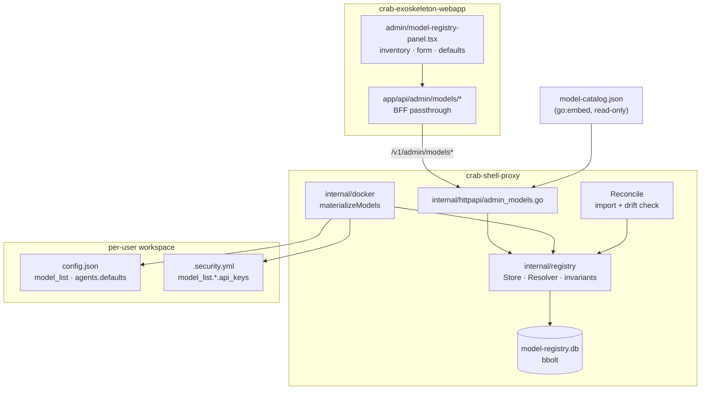
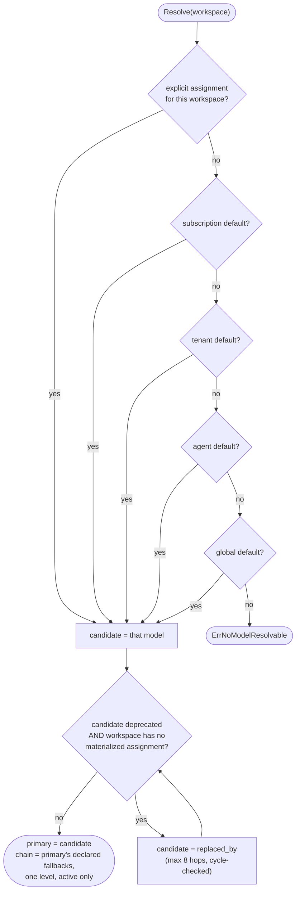
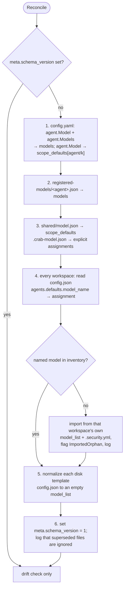

# model-registry-source-of-truth — Design

Derived from `spec.md` and `context.md`. Verified facts carry a file:line
reference; everything else is a design decision.

## 1. Architecture



The new package `internal/registry` is the only thing that knows the storage
shape. `internal/docker` depends on it for resolution and materialization;
`internal/httpapi` depends on it for the admin surface. Nothing else reads model
state.

## 2. Storage

`go.etcd.io/bbolt` — pure Go (NFR-1), ACID, one writer at a time by
construction. Single file at `<containerDataRoot>/model-registry.db`: on the
persisted volume, a sibling of `tenants/` and `registered-models/` rather than
inside any workspace tree, so no `chownTree` pass ever reaches it (NFR-2).

### Buckets

| Bucket | Key | Value |
|---|---|---|
| `models` | `model_name` | `Model` (JSON) |
| `assignments` | `<tenant>/<subs>/<agent>/<user>`, each segment `identity.SanitizeID`'d | `Assignment` (JSON) |
| `scope_defaults` | `global` \| `agent/<key>` \| `tenant/<t>` \| `subs/<t>/<s>` | `ScopeDefault` (JSON) |
| `meta` | `schema_version` | integer |

`model_name` is the natural key: it is simultaneously the value written to
`agents.defaults.model_name` and the key under `.security.yml`'s `model_list`.
Uniqueness on it (FR-3) is what keeps one credential slot per model.

### Records

```go
type Model struct {
    ModelName  string          `json:"model_name"`
    Provider   string          `json:"provider"`
    Model      string          `json:"model"`
    APIBase    string          `json:"api_base"`
    APIKey     string          `json:"-"`            // persisted; never marshalled to a client
    AuthMethod string          `json:"auth_method,omitempty"`
    ExtraBody  json.RawMessage `json:"extra_body,omitempty"`

    Status     Status          `json:"status"`       // active | disabled | deprecated
    ReplacedBy string          `json:"replaced_by,omitempty"`
    Fallbacks  []string        `json:"fallbacks,omitempty"` // ordered model_names
    Position   int             `json:"position"`     // UI list order; no functional effect

    Version    uint64          `json:"version"`
    CreatedAt  time.Time       `json:"created_at"`
    UpdatedAt  time.Time       `json:"updated_at"`

    ImportedOrphan bool        `json:"imported_orphan,omitempty"` // FR-23
}

type Assignment struct {
    ModelName      string    `json:"model_name"`    // the primary
    Chain          []string  `json:"chain"`         // fallback names materialized alongside it
    Source         Source    `json:"source"`        // explicit | inherited
    MaterializedAt time.Time `json:"materialized_at"`
}

type ScopeDefault struct {
    ModelName string    `json:"model_name"`
    UpdatedAt time.Time `json:"updated_at"`
}
```

`APIKey` is tagged `json:"-"` so the wire type cannot leak it by omission
(NFR-4); persistence uses a separate internal struct that includes it. The API
response type adds `has_key bool` and `in_use_count int`, both computed.

## 3. Resolution

One exported function, and it is the only answer to the question (FR-12):

```go
func (r *Registry) Resolve(key WorkspaceKey) (primary *Model, chain []*Model, err error)
```



The deprecation hop (FR-13) is deliberately conditioned on the *absence* of a
materialized assignment: that is what makes "new users get the replacement while
existing users keep the old model" fall out of resolution rather than needing a
separate code path. Traversal is bounded at 8 hops with a visited set; exceeding
either is an error naming the chain, not a silent fallback.

`chain` is the primary's own `Fallbacks`, in declared order, expanded **one level
only** and filtered to `active` models — a non-active entry is skipped and logged
(AC-15b) rather than failing the resolution. `position` is presentation only
(CTX-MR-09): it orders the active list in the UI and nothing else reads it.

A reorder therefore submits **every** model's name, active and inactive alike:
`SetPositions` renumbers `1..N` over exactly what it receives, so submitting only
the active group would leave inactive models holding stale positions that collide
with active ones — and a reactivated model would no longer land back in its place.

### Re-materialization triggers

Per FR-19, all eager, all stop/start:

| Change | Affected workspaces |
|---|---|
| scope default | those resolving through it. A workspace with an explicit pin is skipped **entirely** — not re-materialized to the same bytes and then restarted anyway. `global`/`agent` have no scope to sweep and are left to the next start |
| per-user assignment | that workspace |
| model definition or key | those whose `Assignment` names it as primary **or** in `chain` |
| a model's `fallbacks` | those whose `Assignment` names it as primary |
| reorder (`position`) | none — presentation only (AC-19) |
| deprecation | none — existing users keeping the model is the point |

Recording `Chain` on the `Assignment` is what makes the definition/key trigger
correct: without it a key edit would reach only the workspaces where the model is
primary, leaving every workspace that has it as a fallback holding a revoked
credential. The lookup is the same `assignments` scan `referrers` performs.

### Deletions this enables

`internal/docker/model.go` loses `resolveModel`, `reapplyModel`,
`getModelOverride`, `setModelOverride`, `clearModelOverride`, `EffectiveModel`,
`SetModelOverride`, `ClearModelOverride` and `ModelSel`. `ReapplyModelScope` /
`ReapplyModelUser` survive but call `Resolve` + `materializeModels`.
`internal/docker/registered_models.go` is deleted outright.
`config.Agent.SelectableModels` / `FindModel` remain only for the migration seed
and for hermes (CTX-MR-13).

## 4. Invariants

All enforced inside one `bolt.Update` transaction (NFR-3), so the check and the
write cannot be split:

| ID | Rule | On violation |
|---|---|---|
| I1 | `model_name` unique | 409 |
| I2 | delete blocked while referenced by an assignment (as primary or chain member), a scope default, another model's `replaced_by`, or another model's `fallbacks` | 409 + referrer list |
| I3 | `→ disabled` has I2's precondition | 409 + referrer list |
| I4 | `→ deprecated` requires `replaced_by` naming an existing model that is not `disabled` and not itself. A `deprecated` replacement is a legitimate chain link — resolution hops onward from it — which is what lets a series of models be retired incrementally | 400 |
| I5 | deprecation chains acyclic | 400 |
| I6 | write `version` must match stored | 409 |
| I7 | responses never carry `api_key` | — (type-enforced, §2) |
| I8 | every name in `fallbacks` exists; a model may not list itself | 400 |

`referrers(model_name)` is one scan of `assignments` plus one of
`scope_defaults` plus one of `models` (covering both `replaced_by` and
`fallbacks`). With tens of models and hundreds of workspaces a full scan inside
the transaction is cheaper than maintaining reverse indexes, and it cannot drift.

I2 is satisfiable precisely because chains are **declared** rather than derived
from the active set: detaching a model from the one or two `fallbacks` lists that
name it is a concrete action the 409 tells the admin to take. Had the chain been
"every active model", every active model would be referenced by every workspace
and I2 would be unsatisfiable — see CTX-MR-09 for why that shape was rejected.

## 5. Materialization

`applyModel` (`internal/docker/provision.go:103`) becomes:

```go
func materializeModels(configPath, secPath string, primary *Model, chain []*Model) error
```

**`config.json`** — replaces `model_list` wholesale with `[primary, ...chain]`.
Each entry: `model_name`, `provider`, `model`, `api_base`, `"enabled": true`,
plus `auth_method` / `extra_body` when set. **No `api_key` field** (FR-16,
CTX-MR-07). Then `agents.defaults.provider` / `model_name` = primary, and
`agents.defaults.model_fallbacks` = the chain's names in order. The existing
`channel_list.pico.enabled = true` write is preserved.

**`.security.yml`** — read-modify-write (the shape `setModelListEntry`
already uses, `internal/docker/model.go:151`): for each materialized model, set
`model_list.<model_name>.api_keys = [key]`, **and prune** any `model_list` entry
outside the materialized set (FR-17b). Pruning is necessary because `config.json`'s
`model_list` is replaced wholesale while this file is read-modify-write — without
it, every model a workspace ever used keeps its key here forever and the two files
drift permanently. `unsetNativeSlot` (`internal/docker/secrets.go:111`) is the
existing machinery. The pico channel token, the `web.*` families and every
native-secret overlay slot are untouched. `writeSecurityConfig` already chowns and
re-locks 0444.

Then record the assignment (FR-17): primary, `chain`, and a `source` reflecting
whether the resolution came from an explicit per-user pin or a scope default.

**No resolvable model** — `provision` returns `ErrNoModelResolvable` before
creating anything (FR-18). This is load-bearing: picoclaw fails at startup when
`agents.defaults.model_name` names a model absent from `model_list`, so the
alternative is a permanently unbootable workspace.

`applyNativeSecrets` (`provision.go:86`) still runs after materialization, so a
scope's native `model_list.<m>.api_keys` overlay lands on top — the documented
override of CTX-MR-12.

## 6. Templates and the suggestion catalog

| File | Before | After |
|---|---|---|
| `internal/docker/defaulttemplate/picoclaw/config.json` | 30 `model_list` entries | `"model_list": []`, empty `agents.defaults.provider`/`model_name` |
| `<dataRoot>/templates/<agent>/config.json` (per instance) | bootstrapped copy, operator-editable, carries a `model_list` | **normalized** by the migration to the same empty shape (FR-20, AC-17) |
| `internal/docker/model-catalog.json` | — | new, `go:embed`, the 30 entries as suggestions (`provider`, `model`, `api_base` only) |

Normalization is the migration's only destructive write, so it copies the file to
`config.json.pre-registry` first — cheap, and it makes the one irreversible step
reversible by hand.

Normalizing the disk template rather than importing it is user-directed
(CTX-MR-08): a template that still carried models would remain a place the truth
could appear to live, and an operator editing it would get no effect with no
explanation. Nothing in use is lost, because §7 step 4 reads each workspace's own
`config.json` and `.security.yml` — that, not the template, is where a
currently-working model provably exists. A template model that no workspace uses
and that is not a scope default is dropped by design.

## 7. Migration

Runs inside `Reconcile` (`internal/docker/reconcile.go:19`), guarded by
`meta.schema_version` so a second boot is a no-op (NFR-7).



Ordering matters: later sources win on `model_name` collision, because a
`registered-models` entry or a live workspace holds a key an admin actually
entered, whereas the `config.yaml` seed may name an environment variable that is
no longer set.

Step 4 is the anti-orphaning step (FR-22) and the reason the disk template needs
no import: a model that any workspace is actually running is recovered from that
workspace's own `config.json` + `.security.yml`. Without step 4 every existing
user reads as unassigned, and the first scope-default change re-resolves them —
the exact failure this feature exists to remove. AC-11 tests precisely this:
migration alone changes no workspace's active model.

Step 5 normalizes the disk templates (FR-20, AC-17). It is ordered last among the
mutating steps not because of a data dependency — it touches templates, step 4
touches workspaces — but so that a failure anywhere earlier leaves the templates
untouched and the whole migration re-runnable.

**Drift check** (FR-25, every boot): for each workspace, compare `config.json`'s
active model against the recorded assignment and log mismatches. Read-only — a
correction is an explicit admin reapply, never a boot-time surprise.

## 8. HTTP surface

`/v1/admin/registered-models*` is removed. New handlers in
`internal/httpapi/admin_models.go`:

| Method | Route | Gate |
|---|---|---|
| `GET` | `/v1/admin/models` | `HasAdminPrivileges` |
| `POST` | `/v1/admin/models` | `HasAdminPrivileges` |
| `PUT` | `/v1/admin/models/{name}` | `HasAdminPrivileges` |
| `DELETE` | `/v1/admin/models/{name}` | `HasAdminPrivileges` |
| `POST` | `/v1/admin/models/{name}/deprecate` | `HasAdminPrivileges` |
| `PUT` | `/v1/admin/models/order` | `HasAdminPrivileges` |
| `GET` | `/v1/admin/models/{name}/usage` | `HasAdminPrivileges` |
| `GET` | `/v1/admin/model-catalog` | `HasAdminPrivileges` |
| `GET`/`PUT`/`DELETE` | `/v1/admin/model-defaults?scope=global\|agent` | `HasAdminPrivileges` |
| `GET`/`PUT`/`DELETE` | `/v1/admin/model-defaults?scope=tenant\|subscription` | `AuthorizeSharedScope` |
| `POST`/`DELETE` | `/v1/admin/model-assignments` | `AuthorizeUserManagement` |

Inventory mutations take the proxy-admin gate because the caller supplies API
keys whose blast radius is the whole instance (FR-26). The `global` and `agent`
defaults are instance-wide and take the same gate — `AuthorizeSharedScope` has no
level above tenant to express. Tenant and subscription defaults and per-user
assignment keep the tier checks those operations already use
(`authz.AuthorizeSharedScope`, `authz.AuthorizeUserManagement`).

There is no duplicate endpoint (FR-29 is client-side): `GET` already returns
every field except the key, so duplication is a prefilled form.

`PUT /v1/admin/models/{name}` omitting `api_key` keeps the stored key; sending
one replaces it. There is no way to read one back.

Status codes: 400 invalid input or I4/I5; 403 gate; 404 unknown model; 409 I1,
I2, I3, I6 and `ErrNoModelResolvable` on assignment.

The mycelium gateway must allow the new route prefixes, as it already does for
`/v1/admin/registered-models` (see the parent repo's gateway config).

## 9. Webapp

`app/admin/model-registry-panel.tsx` is rewritten in three regions; `lib/registeredModels.ts`
becomes `lib/models.ts` with the new shapes.

**Inventory** — two lists. *Active*: reorderable, and the order **is** the
fallback chain (FR-27, AC-15). *Inactive*: `disabled` and `deprecated` together,
badged with the reason and, for deprecated, `→ replaced by X`. Every row shows
`provider · api_base`, a `key` badge, and the usage count; delete and disable are
rendered unavailable with the reason while in use (FR-30).

**Register / edit** — a select fed by `GET /v1/admin/model-catalog` prefills
`provider`, `model`, `api_base`, with a manual option; plus `model_name`
(uniqueness surfaced from the 409) and `api_key`. Duplicate opens this form
prefilled with `model_name` and `api_key` blank (FR-29).

**Defaults and assignment** — the scope default for the selected
tenant/subscription, and the per-user list with an explicit override plus an
"inherited from ⟨scope⟩" indicator.

A 409 renders "another admin changed this — reload" (FR-31), distinct from a
generic error. Conditional styling uses `class-variance-authority` variants, not
interpolated `className` strings, matching the codebase's convention.

## 10. Testing

| Area | Coverage |
|---|---|
| Store invariants | I1–I8 each rejected in-transaction with nothing written; a `fallbacks` referrer blocks delete/disable and detaching it unblocks (AC-15c) |
| Resolver | all five cascade levels; explicit beats inherited (AC-8); deprecation hop only for unmaterialized workspaces (AC-6); cycle and hop-limit errors; a non-active fallback is skipped and logged (AC-15b) |
| Materialization | `config.json` entry has no `api_key` and `.security.yml` has the key (AC-2); a stale sibling key is pruned and the pico token survives (AC-2, FR-17b); `model_fallbacks` matches the primary's declared `fallbacks` (AC-15) |
| Provision refusal | no model resolvable ⇒ error, no container (AC-9) |
| Migration | fixture data root with all five pre-migration sources ⇒ every workspace assigned and no active model changed (AC-11); second run is a no-op (AC-12) |
| HTTP | each gate returns 403 for the wrong tier (AC-13); 409 shapes carry referrers / version conflict |
| Webapp | listing splits active/inactive; duplicate blanks the two fields (AC-14); 409 renders the reload banner |

## 11. Risks

- **Migration is the highest-risk step.** It runs at boot against live data and
  its failure mode is a workspace losing its model. Mitigations: read-only until
  the final transaction, the schema marker written last, superseded files left
  intact (FR-24), the one destructive write (template normalization) backed up to
  `config.json.pre-registry`, and AC-11 asserting no active model changes.
- **Key spread is bounded but not zero.** A workspace's `.security.yml` holds the
  keys of its primary plus that primary's declared fallbacks (CTX-MR-09). A long
  `fallbacks` list on a widely-used model still spreads keys widely — the UI should
  make the chain visible on the row so the consequence is legible.
- **Hermes divergence.** Until CTX-MR-13 is resolved, "single source of truth"
  is true for picoclaw agents only. The inventory must not be presented in the UI
  as governing hermes agents.
- **Native overlay confusion.** CTX-MR-12 keeps a second place a model key can
  come from, as a deliberate scope override. If the user prefers strictness, drop
  the slot family instead — a smaller change than adding it back later.

## 12. Open items for the user

### RESOLVED — chain membership is a declared reference

The question below was raised as blocking and **settled by the user in favour of
option (a)**: each model declares its own `fallbacks` list. `Assignment` gained a
`Chain` field so the eager triggers and the drift check see the whole materialized
set; `referrers` counts `fallbacks` membership; `position` survives as
presentation only. §2, §3, §4 and §5 above reflect the resolution — the record
below is kept because it is the reasoning that shaped the data model.

<details>
<summary>Original framing</summary>

#### Does chain membership count as a reference?

CTX-MR-09 makes the chain "every active model, in `position` order", so every
active model is materialized into **every** workspace: a `config.json`
`model_list` entry, a `.security.yml` key, and a slot in
`agents.defaults.model_fallbacks`. But `Assignment` records only the **primary**,
so `referrers` (§4) counts primaries, scope defaults and `replaced_by` — and
misses chain membership entirely. Two consequences:

- A model that is `active` but primary nowhere has **zero referrers**, so I2
  permits deleting it. Nothing re-materializes, because FR-19's eager trigger is
  the same assignments lookup. Every workspace keeps a `model_list` entry and a
  `model_fallbacks` reference to a model that no longer exists. FR-25's drift
  check compares only the *active* model, so it does not notice either.
- Editing that model's key propagates nowhere, for the same reason. Fallback
  silently keeps a stale or revoked credential — the failure mode fallback exists
  to prevent.

Counting chain membership as a reference does not fix it either: every active
model would then be referenced by every workspace, so nothing could ever be
deleted, and disabling first carries the same precondition. Deadlock.

The deeper point this exposes: with chain = all active models, **any** change to
the active set or to any active model's credentials is a fleet-wide change. That
cost is larger than CTX-MR-09 represented, and it is the real trade-off — not key
spread.

Three exits:

- **(a) Per-model explicit `fallbacks` list** — the option CTX-MR-09 deferred.
  Chain membership becomes a declared, countable reference; I2/I3 work with no
  deadlock; blast radius and key spread are both bounded by who declares the
  model; it is picoclaw's own field shape (`ModelConfig.Fallbacks`). Cost: the
  admin declares a fallback list per model instead of one global order — which is
  **not** the single reorderable list the user asked for.
- **(b) Keep chain = all active, split the precondition** — delete blocks on
  primary-use ∪ scope-default ∪ `replaced_by`; disable blocks on primary-use only
  and eagerly re-materializes every workspace to drop the model. Preserves the
  single global order, but makes delete and disable fleet-wide restarts, which
  sits badly beside FR-19's decision that a reorder must not restart the fleet.
- **(c) Store the full materialized set in `Assignment`** — `referrers`
  distinguishes primary use (blocks delete/disable) from chain use (does not
  block, but marks those workspaces stale). Delete/disable of a non-primary
  active model is allowed and enqueues the same lazy re-materialization a reorder
  does; FR-25's drift check is extended to the whole materialized set so
  staleness is visible and countable. Preserves the single global order and avoids
  fleet restarts, at the cost of an explicit stale window during which a
  workspace's fallback list names a deleted model.

Recommendation: **(a)** if bounded blast radius matters more than the exact UI
shape; **(c)** if the single reorderable list is non-negotiable. (b) is dominated
by (c).

</details>

### Non-blocking

1. Confirm CTX-MR-12 (keep the native `model_list.*.api_keys` slot as a scope
   override) versus dropping it for strict single-sourcing.
2. Confirm that removing `config.yaml`'s `agent.Model` from the runtime path is
   acceptable for operators who configure models that way today — after
   migration it becomes a seed, and further edits to it have no effect.
