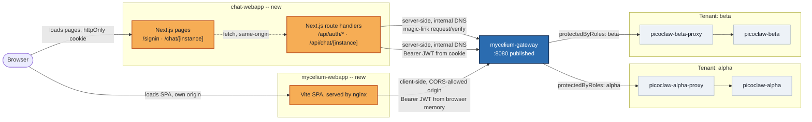

# Mycelium Chat Webapp Design

**Spec**: `.specs/features/mycelium-chat-webapp/spec.md`
**Context**: `.specs/features/mycelium-chat-webapp/context.md`
**Status**: Shipped (Phase A only -- Phase B below superseded, see STATE.md AD-006)

> Phase B (base mode, Postgres, `protectedByRoles`) was never executed. Phase A's spike (T12)
> proved a `protected`/`protectedByRoles` route rejects *any* freshly signed-up account
> regardless of role (STATE.md L-006), which conflicts with this feature's own "sign in and
> chat now" requirement. Shipped routes are `authenticated` (email-based identity) instead --
> see STATE.md AD-006. Phase B is kept below as a reference for a future role-scoped-access
> feature, not as work still planned under this one.

---

## Rollout Phasing (see STATE.md AD-005) -- historical, see note above

This design is executed in two passes, not one:

- **Phase A** — build `chat-webapp` and `mycelium-webapp`, verify magic-link signin + chat
  end-to-end against the **current** `standalone`/SQLite gateway, on the existing `protected`
  routes (no role gate). Email is read via `docker compose logs mycelium-gateway` (stub
  transport, already working today, no config change). This proves the BFF/UI logic in
  isolation, on the cheapest possible backend.
- **Phase B** — migrate `mycelium-gateway` to `base` mode (Postgres, Mailpit, no Redis
  container) as its own spiked step: boot it and confirm it stays up without Redis, confirm
  `myc-cli accounts create-seed-account` works against Postgres, confirm a real magic-link email
  arrives in Mailpit -- *then* flip the routes to `protectedByRoles` and document the
  `mycelium-webapp` role-assignment steps. `chat-webapp` itself does not change between phases;
  it only ever talks to "whatever `mycelium-gateway` currently exposes."

Everything below describes the end state (post-Phase-B). Where a component only exists starting
Phase B, it's marked `[Phase B]`.

---

## Architecture Overview

Two new pieces sit alongside the existing gateway/proxy/picoclaw chain. Neither the picoclaw
instances nor the proxies change -- only the gateway's route security groups do.



The key asymmetry: `chat-webapp`'s browser code never talks to Mycelium directly -- every call
goes through its own server first (BFF, per AD-001). `mycelium-webapp` is the opposite: it's a
static SPA with no server of its own, so it necessarily calls Mycelium straight from the
browser, same as upstream. That's why `mycelium-webapp` needs its own CORS-allowed origin on
the gateway, while `chat-webapp` doesn't (server-to-server calls aren't subject to browser CORS).

---

## Code Reuse Analysis

### Existing Components to Leverage

| Component | Location | How to Use |
|---|---|---|
| `mycelium/Dockerfile.standalone` build pattern (git clone, pinned commit, no local source copied) | `mycelium/Dockerfile.standalone` | Mirror the same pattern for `mycelium-webapp/Dockerfile` -- git-clone the upstream repo at a pinned commit instead of copying the local monorepo checkout. |
| `docker-compose.yaml` healthcheck/`depends_on: condition: service_healthy` convention | `docker-compose.yaml` | Apply same convention to `chat-webapp` and `mycelium-webapp` service defs. |
| proxy's OpenAI-compatible response contract (`choices[0].message.content`, `session_id` in body) | `picoclaw-openai-proxy/server.js:257-341` | `chat-webapp`'s `/api/chat/[instance]` route forwards to this exact contract -- no changes needed on the proxy side. |
| Mycelium magic-link contract (verified against real source, see context.md) | n/a (external) | `chat-webapp`'s `/api/auth/*` routes call `POST /_adm/beginners/users/magic-link/request` and `/verify` on `mycelium-gateway` directly -- these are gateway-native admin routes, not `[api.services]` proxied routes, so no new TOML route entries are needed for auth itself. |

### Integration Points

| System | Integration Method |
|---|---|
| `mycelium-gateway` (auth) | `chat-webapp` server calls `http://mycelium-gateway:8080/_adm/beginners/users/magic-link/{request,verify}` over the internal `zombie_net` network. |
| `mycelium-gateway` (chat) | `chat-webapp` server calls `http://mycelium-gateway:8080/picoclaw-{instance}/v1/chat/completions` with `Authorization: Bearer <jwt-from-cookie>`. |
| `mycelium-gateway` (CORS) | `mycelium-webapp`'s browser-side calls require its own origin added to `[api].allowedOrigins` in `config.standalone.toml`. |
| `mycelium/config.standalone.toml` | Route `group` changes from `"protected"` to `{ protectedByRoles = [...] }` for all four existing paths -- no new services/routes added. |

---

## Components

### `chat-webapp` (new Next.js app, `webapp/`)

- **Purpose**: Human-usable signin + instance picker + chat, acting as a BFF so the Mycelium
  JWT never reaches browser JS.
- **Location**: `webapp/` (new top-level directory, plain, not a submodule)
- **Interfaces** (route handlers, all under `webapp/app/api/`):
  - `POST /api/auth/request { email }` -> calls Mycelium's magic-link request; always 200
    (mirrors Mycelium's own anti-enumeration behavior).
  - `POST /api/auth/verify { email, code }` -> calls Mycelium's verify; on success, sets
    `myc_session` httpOnly cookie (JSON: `{ token, email }`), 200; on wrong code, 401.
  - `GET /api/auth/session` -> reads the cookie server-side, returns `{ authenticated, email }`
    (never the token itself) for the client to render "signed in as ...".
  - `POST /api/auth/logout` -> clears `myc_session`, 200.
  - `POST /api/chat/[instance] { message, session_id }` -> reads `myc_session`, forwards to
    `mycelium-gateway`'s `/picoclaw-{instance}/v1/chat/completions` as `{ model: "picoclaw",
    session_id, messages: [{role:"user", content: message}] }` with the stored JWT as
    `Authorization: Bearer`; maps the gateway's 401 to "session expired" (clears cookie) and
    403 to "role not assigned" distinctly from a network failure.
- **Pages** (`webapp/app/`):
  - `/signin` -- two-step email/code form (same UX shape as reference `mycelium-webapp`'s
    `HomePage`: step 1 email, step 2 code, "back" to retry email).
  - `/chat` -- instance picker (`alpha` / `beta` buttons, both always shown per CHAT-03).
  - `/chat/[instance]` -- conversation view: message list + input, calls
    `/api/chat/[instance]`, generates a fresh `session_id` (client-side `crypto.randomUUID()`)
    whenever the instance changes.
- **Dependencies**: Next.js (App Router), no auth library needed -- the flow is two plain fetch
  calls plus a cookie, not OAuth/OIDC.
- **Reuses**: proxy's existing response contract; no new backend code on the proxy or picoclaw
  side.

### `webapp/middleware.ts`

- **Purpose**: Gate `/chat` and `/chat/*` behind the presence of `myc_session`; unauthenticated
  requests redirect to `/signin`.
- **Location**: `webapp/middleware.ts`
- **Interfaces**: standard Next.js middleware, `matcher: ['/chat/:path*']`.
- **Dependencies**: reads the `myc_session` cookie only (presence check; the route handlers do
  the real validation against Mycelium on each call).

### `mycelium-webapp` (new service, official image built from source)

*Buildable and reachable starting Phase A (points at whichever gateway is currently up); its
role-assignment screens are only actually *usable* starting Phase B, once a Staff account
exists.*

- **Purpose**: Operator-facing admin UI for accounts/tenants/guest-roles -- specifically, the
  place an operator assigns a signed-up account to the `alpha`/`beta` roles (CHAT-05, AD-002).
- **Location**: `mycelium-webapp/Dockerfile` (new directory in this repo, mirrors
  `mycelium/Dockerfile.standalone`'s "git clone at build time, pin a commit, no local source
  copied" convention)
- **Interfaces**: none of our own -- it's the upstream app unmodified, configured only via the
  `VITE_MYCELIUM_API_URL` build arg.
- **Dependencies**: `mycelium-gateway` reachable from the *browser* (not just internally) --
  build arg must be the gateway's host-published URL (`http://localhost:${MYCELIUM_PORT:-8080}`
  by default), since Vite bakes it in at build time, and the gateway's `allowedOrigins` must
  include this service's own published origin.
- **Reuses**: `mycelium/Dockerfile.standalone`'s build pattern (adapted: Node/Vite/nginx stages
  instead of Rust/cargo, but same "clone pinned upstream commit, no local source" shape).

---

## Data Models

### Session cookie payload (`myc_session`, httpOnly, JSON-encoded)

```typescript
interface SessionCookie {
  token: string   // Mycelium JWT, as returned by /magic-link/verify
  email: string    // from the same verify response -- avoids decoding the JWT to display identity
}
```

**Relationships**: Not persisted anywhere server-side -- the cookie itself is the only session
store (stateless BFF, consistent with Mycelium being the actual source of truth/validator on
every forwarded call).

### Chat message (client-side render state only, not persisted)

```typescript
interface ChatMessage {
  role: "user" | "assistant"
  content: string
}
```

---

### `mycelium-postgres` [Phase B]

- **Purpose**: Backing database for `base` mode, replacing SQLite -- required so `myc-cli
  accounts create-seed-account` has somewhere to write the first `Staff` account (AD-003).
- **Location**: `docker-compose.yaml` (new service), `postgres:12` image, matching the version
  the upstream reference compose pins.
- **Dependencies**: none. `mycelium-gateway` depends on it (`condition: service_healthy`,
  `pg_isready`).
- **Reuses**: upstream's own `myc-postgres` service definition shape
  (`mycelium-api-gateway/docker-compose.common.yaml`).

### `mailpit` [Phase B]

- **Purpose**: Local SMTP catcher so magic-link emails are actually deliverable once
  `standalone`'s stub transport is no longer compiled in (AD-004) -- without requiring real SMTP
  credentials from anyone running this stack.
- **Location**: `docker-compose.yaml` (new service), `axllent/mailpit` image, no config needed.
- **Interfaces**: SMTP listener on `1025` (internal only), web UI on its own published port to
  read delivered mail.
- **Dependencies**: none.
- **Risk flagged, not yet verified**: `SmtpConfig::build_transport` (mycelium's own code) calls
  lettre's `SmtpTransport::relay(&host)`, which expects the server to support TLS. Mailpit's
  default listener on `:1025` is plaintext. Whether this handshake succeeds against Mailpit as-is
  is **unverified** -- this is exactly what Phase B's spike step checks first, with a documented
  fallback (Mailpit's `--smtp-tls-cert`/`--smtp-tls-key` flags, or real SMTP) if it doesn't.

---

## Docker Compose Changes

Two new services from Phase A, two more from Phase B, one config change (Phase B), no changes
to existing picoclaw/proxy services:

```yaml
chat-webapp:
  build: ./webapp
  environment:
    MYCELIUM_INTERNAL_URL: http://mycelium-gateway:8080   # server-side calls, internal DNS
  ports:
    - "${CHAT_WEBAPP_PORT:-3000}:3000"
  depends_on:
    mycelium-gateway:
      condition: service_healthy
  networks: [zombie_net]

mycelium-webapp:
  build:
    context: ./mycelium-webapp
    args:
      VITE_MYCELIUM_API_URL: http://localhost:${MYCELIUM_PORT:-8080}   # browser-reachable, baked at build
  ports:
    - "${MYCELIUM_WEBAPP_PORT:-8081}:80"
  networks: [zombie_net]
```

`mycelium/config.standalone.toml`: `allowedOrigins` gains
`"http://localhost:${MYCELIUM_WEBAPP_PORT:-8081}"` (mycelium-webapp's browser-side calls need
CORS); each of the four existing `[[picoclaw-*.path]]` blocks' `group = "protected"` becomes
`group = { protectedByRoles = [{ name = "alpha" }] }` (or `"beta"`, matching the instance).

`chat-webapp` does not need a CORS entry -- its own browser code only ever calls its own
origin's `/api/*` routes.

---

## Error Handling Strategy

| Error Scenario | Handling | User Impact |
|---|---|---|
| Wrong/expired magic-link code | `/api/auth/verify` returns 401; page shows inline error, stays on code step | "Invalid code, try again" |
| JWT expired mid-session (chat call gets 401 from gateway) | `/api/chat/[instance]` clears `myc_session`, returns 401 to client | Client redirects to `/signin` with "session expired" |
| Caller lacks `alpha`/`beta` role (gateway 403) | `/api/chat/[instance]` passes through 403 with a distinct error code (`role_required`) | "You don't have access to this instance yet -- ask an operator to assign your role" |
| `mycelium-gateway` unreachable/timeout | route handlers catch fetch errors, return 502 with `connectivity` error code | Generic "can't reach the gateway right now" banner, distinct from auth errors |
| `mycelium-webapp` misconfigured CORS (forgot `allowedOrigins`) | browser fetch fails with a CORS error in devtools | Caught during manual verification in Execute -- not a runtime user-facing path, but worth a task-level check |

---

## Tech Decisions (only non-obvious ones)

| Decision | Choice | Rationale |
|---|---|---|
| Token storage | httpOnly cookie, BFF pattern | Locked by AD-001 (context.md) -- trades build simplicity for not exposing the JWT to browser JS. |
| Chat streaming | Non-streaming (`stream: false`) for MVP | Proxy supports SSE, but polling a single JSON response keeps the BFF route trivial; streaming through a Next.js Route Handler is a real added complexity not needed to satisfy CHAT-04's acceptance criteria. Noted as a future enhancement, not this feature. |
| `alpha`/`beta` role seeding | None -- documented manual step | Locked by AD-002 (context.md) -- Mycelium auto-creates the `GuestRole` records from the TOML declaration; only account *assignment* is manual, via `mycelium-webapp`. |
| `mycelium-webapp` build source | Git clone of upstream repo at a pinned commit, not a copy of the local monorepo checkout | Consistent with this project's existing `mycelium/Dockerfile.standalone` convention -- reproducible, doesn't depend on a local checkout being present on whoever's machine builds this stack. |
| Next.js app directory | New top-level `webapp/` in this repo, not a submodule | Agent's discretion per context.md -- this is a test client for this repo's own stack, not an independently reusable project like `picoclaw-openai-proxy`. |
