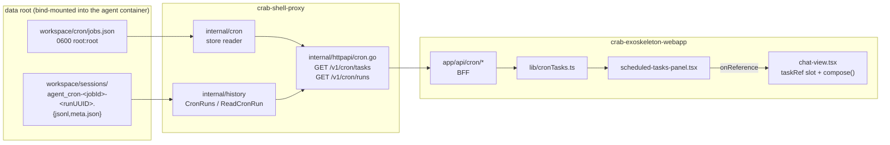

# scheduled-tasks — Design

Two submodules. The proxy grows a read-only view over two on-disk sources that
already exist; the webapp grows a panel and a composer slot. No schema, no
migration, no write path.

## Data flow



The join is the job-id segment of the run key: `agent:cron-<jobId>-<runUUID>`.
Tasks come from the store, runs come from the sessions directory, and neither is
the authority for the other — which is why orphan runs are a first-class result
rather than an error (`deleteAfterRun` removes the job but not its transcripts).

## Proxy components

### `internal/config` — one helper

`CronFile(root, tenantID, subsAccID, role, userAccID)` →
`UserWorkspace/workspace/cron/jobs.json`, placed next to `SessionsDir`
(`config.go:499`) with the same signature shape. Nothing else in config changes.

### `internal/cron` — the store reader

One responsibility: turn `jobs.json` bytes into typed jobs, or say why it can't.

- `Job` mirrors the verified record: `ID`, `Name`, `Enabled`, `Schedule`,
  `Payload`, `State`, `CreatedAtMs`, `UpdatedAtMs`, `DeleteAfterRun`.
- `Schedule` keeps `Kind` plus all three optional parameters (`Expr`, `EveryMs`,
  `AtMs`). Unknown kinds keep their `Kind` string and carry no parameter — the
  caller renders what it has (NFR-3).
- `Payload` keeps `Kind`, `Message`, `Channel`, `To`. Unknown kinds keep `Kind`.
- `State` keeps `NextRunAtMs`, `LastRunAtMs`, `LastStatus`, `LastError`.
  `LastStatus` is a plain string, never compared against a literal (NFR-2).
- `Load(path)` returns `(jobs, error)`. A missing file is `(nil, nil)` — the
  empty-workspace case, not a failure (ST-1). A `version` other than `1` is an
  error naming the version it found.

Read-only by construction: the package exposes no writer.

### `internal/history` — two new exported functions

This package already owns the session file format and the `metaFile` parse, so the
cron readers belong here rather than in a new package that would duplicate both.
They are **separate functions**, never a parameterization of `findSessionFiles`.

- `CronRuns(sessionsDir) ([]CronRun, error)` — scans `*.meta.json`, keeps only keys
  with the `agent:cron-` prefix, and for each one returns `JobID` (the segment
  between the prefix and the next `-`), `RunID`, `Basename`, `StartedAt`
  (`created_at`), `UpdatedAt`, `Count`, and `Prompt` — the transcript's first entry,
  read with a line scanner so a 112 KB file costs one line (NFR-5). A meta whose
  `.jsonl` is missing yields the run with an empty `Prompt` and a flag, not a
  dropped row.
- `ReadCronRun(sessionsDir, basename) ([]CronEntry, error)` — the full transcript,
  **keeping** `role: "tool"` entries and each entry's `ToolCalls`, `ModelName` and
  `CreatedAt`. Deliberately not `readMessages`, which drops `tool` entries because
  a user-facing chat transcript must match what the user saw; here the tool
  activity *is* the content (DEC-ST-01).

Both carry a comment pointing at the `history.go:256-263` rationale and stating
that the `:291` skip must stay (NFR-1).

### `internal/httpapi/cron.go` — two handlers

Auth is cloned from `restart.go`: `tenant_id` and `subs_acc_id` as required query
UUIDs, read access checked on tenant + the resolved agent's role + the
subscription (`authorizeRestartRead`, `:162`), and the workspace key derived from
the caller's mycelium profile via the `restartCallerKey` shape (`:138`) — never
from the request, or one user could read another's tasks.

`GET /v1/cron/tasks` composes the two sources:

```json
{
  "tasks": [{
    "id": "9abd3e01bd0a082a", "name": "Daily summary", "enabled": true,
    "schedule": { "kind": "cron", "expr": "0 18 * * *" },
    "payload": { "kind": "agent_turn", "message": "…", "channel": "pico", "to": "pico:<chatId>" },
    "deleteAfterRun": false,
    "createdAtMs": 0, "updatedAtMs": 0,
    "state": { "nextRunAtMs": 0, "lastRunAtMs": 0, "lastStatus": "", "lastError": "" },
    "runs": [{ "runId": "5e055123-…", "basename": "agent_cron-…", "startedAt": "…",
               "updatedAt": "…", "count": 34, "prompt": "📋 RELATÓRIO DIÁRIO: …",
               "transcriptMissing": false }]
  }],
  "orphans": [{ "jobId": "4daaedfb795f4be8", "runs": [ … ] }]
}
```

Runs are attached to the task sharing their job id; the rest become `orphans`
grouped by job id (ST-3). Runs sort by `startedAt` descending, tie-broken by
`runId` so ordering is total.

`GET /v1/cron/runs?run=<basename>` returns `{"entries": [...]}`. The `run` value is
looked up in the set `CronRuns` discovered and rejected if absent — the request
never reaches `filepath.Join` (NFR-4). This also means a run outside the caller's
own workspace is unreachable by construction, since the set is built from the
caller's `SessionsDir`.

Both routes register in `handlers.go` alongside the existing `GET /v1/...` member
routes. They are the proxy's own REST API, which the monorepo's
JSON-RPC-for-mycelium rule explicitly exempts.

### The gateway also has to know them

Registering a handler in the proxy is only half of it. Every path the webapp reaches
through mycelium must have a matching `[[<agent>.path]]` block in the gateway config,
per agent service, in each deploy profile (`deploy/standalone`, `deploy/prod`,
`deploy/dokploy`). Otherwise the gateway answers
`400 {"error":"Request path does not match any service"}` and the proxy never sees
the request — which is exactly how this was discovered, since no test in either
submodule covers gateway routing.

One block per agent, `path = "/v1/cron/*"`, `methods = ["GET"]`, gated on the role
name (read) like `/v1/restart`, with that agent's `secretName`. A single wildcard
suffices because mycelium's `*` matches exactly one following segment — covering
`tasks` and `runs` — and there is no bare `/v1/cron` handler to collide with.

## Webapp components

### `lib/cronTasks.ts`

Follows `lib/memoryGraph.ts:111-127`: `workspaceQuery` for the tenant/subs/role
params, `get<T>` for fetch → `errorCode` on non-OK → typed JSON. Two functions,
`listTasks(workspace)` and `readRun(workspace, basename)`, plus the TypeScript
mirrors of the DTOs above. Errors throw stable codes that `errorText` translates.

### `app/api/cron/tasks/route.ts`, `app/api/cron/runs/route.ts`

BFF passthrough to the proxy, matching the existing media/memory routes. Session
token from the cookie, tenant/subs/role forwarded, nothing derived client-side.

### `app/chat/scheduled-tasks-panel.tsx`

Its own file (NFR-7). Owns two levels of internal state:

- `tasks` / `error` / `loading`, loaded in a `useEffect` with `let cancelled` and
  deps on `workspace.t`, `workspace.s`, `workspace.r` (NFR-6).
- `expanded: Set<string>` — which tasks show their executions.
- `selectedRun: string | null` — when set, the panel renders the transcript view
  instead of the list, with a back row that clears it. The panel owning its own
  internal navigation follows `memory-graph-panel`, which owns its own tab strip;
  the sidebar's two-pane track is already spent on menu ↔ section.
- `runEntries` — the selected run's transcript, fetched on selection.

Rendering rules that matter:

- Schedule to human form: `cron` → the expression; `every` → the interval from
  `everyMs`; `at` → the instant from `atMs`; anything else → the raw `kind`.
- Task row shows `lastStatus` / `lastError` verbatim when present; execution rows
  show instant, duration (`startedAt`→`updatedAt`) and `count`, and **no success
  mark** (DEC-ST-03).
- Orphans render as a trailing group labelled as removed tasks, named by the run's
  prompt (ST-3).
- Transcript: user and assistant content through the existing message markdown
  renderer; `tool` entries and assistant `tool_calls` collapsed by default behind
  a one-line summary (name and count), each expandable, expanded content
  scrolling in its own container so the narrow resizable column never
  overflows horizontally.
- No `active` prop — it is dead on the sibling panel and must not be copied.

Styling uses `class-variance-authority` variants rather than inline conditional or
interpolated `className`, matching the repo's convention.

### Sidebar registration — `app/chat/uploads-sidebar.tsx`

`"tasks"` joins the `Section` union (`:149`) and `SECTION_ORDER` (`:151`); a
`SECTIONS` entry (`:153-176`) supplies a lucide icon plus `label(t)` and
`blurb(t)`; the detail slot (`:700-707`) renders the panel. Label and blurb live
under different i18n sub-keys, as the existing entries do. Both `en` and `pt` dicts
in `lib/i18n/chat.ts` get the new keys, or `parity.test.ts` fails.

`UploadsSidebar` gains one prop, `onReference`. Its current prop surface
(`:222-241`) is entirely inbound, so this is the first value it passes upward;
it is threaded to the panel and no further.

### Reference slot — `app/chat/chat-view.tsx`, `app/chat/composer.tsx`

Mirrors `replyTo` exactly, which is the same shape of problem already solved:

- `chat-view.tsx`: a `taskRef` state next to `replyTo` (`:132`), set from
  `UploadsSidebar`'s `onReference` (mounted at `:829-835`), cleared by `enqueue`
  along with the other slots (`:408-416`).
- `compose()` (`:386-392`) gains a third segment. The marker is one line, built
  from data already in the panel — no extra fetch:
  - task → `[tarefa agendada: "<name>" (<jobId>) — <schedule>, última execução <instant>]`
  - execution → `[execução: "<name>" (<jobId>), run <runId>, <instant>]`
- `composer.tsx`: a dismissible banner mirroring `:188-209`, with the same
  auto-focus on set (`:157-159`). Two new props, matching the `replyTo` /
  `onCancelReply` pair; the composer's private draft state is not touched.

Nothing changes in `turn-store.ts` or the chat API route — the marker travels in
`message` exactly as `[anexo: …]` does.

## Error handling

Only at the boundaries the repo already treats as boundaries:

- Missing store or sessions directory → empty result, never an error (ST-1).
- Malformed `jobs.json` or an unexpected `version` → one error code surfaced in the
  panel; the panel does not partially render a store it could not parse.
- A single unparseable meta or transcript line is skipped, matching
  `findSessionFiles`, which already skips unreadable and unparseable metas — one
  corrupt file must not blank the list.
- An unknown `run` → 400 with a stable code, translated by `errorText`.

## Testing

Proxy (`go test ./...`):

- `internal/cron`: table tests over the three schedule kinds, an unknown kind, an
  unknown `payload.kind`, unknown extra fields, `jobs: []`, a missing file, and a
  wrong `version`.
- `internal/history`: `CronRuns` extracts job id and run id from real key shapes
  and groups two runs of one job; a meta without its `.jsonl` still yields a row;
  `ReadCronRun` **keeps** `tool` entries and `tool_calls`.
- **Regression (NFR-1):** cron metas still never appear in
  `/v1/sessions/history` and `FindSessionFile` still resolves the user's own
  session when cron runs share its marker. `history_test.go:251-296` already
  encodes this; the new test asserts it alongside the new readers so removing the
  filter breaks a test that names why.
- `internal/httpapi`: auth rejection without `tenant_id`/`subs_acc_id`; a `run`
  value not in the discovered set is rejected; the task↔run join and the orphan
  grouping; the workspace key is never taken from the request.

Webapp (`yarn build` + `yarn test`):

- Panel render test in the established style — `renderToStaticMarkup` under the
  `node` environment, driven through `initialSection="tasks"`, asserting against
  `chatCopy.en` strings (no effects, no fetch).
- `compose()` unit tests: the task marker and the execution marker each serialize
  to one line; a reference plus text plus an attachment compose in a stable order;
  `enqueue` clears the slot.
- i18n parity is already covered by `parity.test.ts`.

Runtime check (UAT): log in via magic link, open the right sidebar, click **Tasks**.
Against this deployment that shows the **empty state and nothing else** — the job
stores are empty and there are no cron session files under `data/` (see spec.md,
"Limit of the runtime check"). The populated paths are verified instead by running
the Go readers against the saved snapshot at `/tmp/zombie-debugging/sessions`, which
must yield 4 runs across 3 job ids and, for
`agent_cron-e520b224e7714d16-5e055123-…`, 34 entries with 23 tool calls.

Reaching the panel's own populated rendering, the reference marker end to end, and a
live task row requires starting the containers and asking the agent to schedule
something. Regardless, reopen a conversation that owns cron tasks and confirm its own
history still loads — the regression this feature must not reintroduce.
