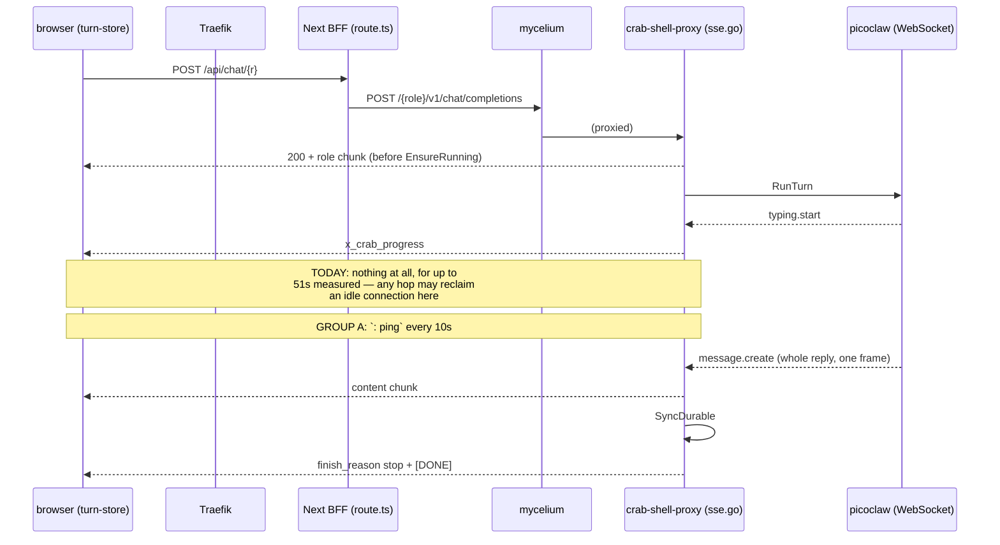

# turn-stream-continuity — Design

Read `spec.md` and `context.md` first. This file is the how, per group, plus the test
plan. It does not restate the why.

## The path a turn's bytes take



Group A fills the `Note` window. Group B removes the BFF as a possible cutter of that
same window. Group C is what happens when the arrow from `P` to `B` breaks anyway.

---

## Group A — heartbeat (`crab-shell-proxy/internal/httpapi/sse.go`)

### Shape

```
: ping\n\n
```

An SSE comment. Nothing else on the wire changes.

### Serializing the writers (FR-5)

`streamTurn` gains a `sync.Mutex` that every writer takes. All five write sites —
`writeChunk`, `writeProgress`, `writeError`, `done`, and the new heartbeat — become
lock / write / flush / unlock. The lock is function-local; it protects one response, and
two concurrent turns share nothing.

The `clientCtx.Err()` guards stay where they are, in the sinks, unchanged. The heartbeat
gets its own, for the same reason (FR-4).

### Lifetime

Start the ticker immediately after the initial role chunk is flushed — that is the moment
the stream exists — and stop it before `done()`. A `context.WithCancel` derived from
`turnCtx`, cancelled by a `defer`, is enough; the ticker goroutine selects on it and on
`time.Ticker.C`.

Ordering that matters: the ticker must be stopped **before** the terminal frames are
written, not merely at function exit. A ping interleaved between `finish_reason: "stop"`
and `data: [DONE]` is harmless to parse but is exactly the sort of thing a later reader
of a packet capture will spend an hour on.

### Interval

`const heartbeatInterval = 10 * time.Second`, beside `turnTimeout`, with the reasoning
from FR-3 as its comment. Not configurable: a knob here would be a knob nobody can set
correctly without knowing the member's carrier.

### What the webapp does about it

Nothing. `consumeStream`'s `if (!line.startsWith("data:")) continue` already discards it
before any callback. **Group A ships as a proxy-only release** — no submodule pointer bump,
no webapp rebuild. That is a deliberate property (DEC-1), and T-03 is what proves it holds
across the real path rather than in theory.

---

## Group B — the BFF (`crab-exoskeleton-webapp`)

### Measure first (T-04)

Before changing anything: hold a turn artificially quiet past the suspected bound and
observe what ends the stream and where. The cheapest rig is a stub upstream — a tiny Go or
Node server that answers the streaming path with SSE headers, one role chunk, then
nothing for N minutes — pointed at by `MYCELIUM_INTERNAL_URL`, with the BFF route consumed
by `curl`. What is being recorded:

- whether the BFF's own read of `res.body` errors, and with what (`UND_ERR_BODY_TIMEOUT`
  and `UND_ERR_HEADERS_TIMEOUT` are the names to watch for);
- at what elapsed time;
- what the browser-side response looks like when it happens — a clean end or an error.

**Write the answer into `spec.md` OQ-2 whichever way it comes out.** A measured "there is
no such bound on node:24" is a valuable result and closes FR-7 with no code.

### If a bound exists

Scope the fix to the streaming route (FR-9). Two candidate shapes, in preference order:

1. **A per-call dispatcher** on the streaming `fetch` only. Requires `undici` as a direct
   dependency (it is not one today — `context.md` §8) and requires confirming that a
   separately-installed `undici`'s `Agent` is accepted by the runtime's built-in `fetch`
   as a `dispatcher`. **Confirm before committing to this shape**; a mismatch here is the
   kind of thing that fails silently by being ignored.
2. **`node:http`/`node:https` directly** for this one route, piped into the `Response`.
   More code, no new dependency, no ambiguity about which client's defaults apply. This is
   the fallback if (1) does not hold up.

Either way, `fetchMycelium` keeps its current behaviour for every other caller; the
streaming route gets its own path through it (an options argument, or a sibling
`fetchMyceliumStream`), and the comment says why the two differ.

### `X-Accel-Buffering` (FR-8)

One header on the returned `Response`, beside `Cache-Control`. Cheap, inert today, and it
documents the requirement in the place someone would look.

---

## Group C — re-attach

### Proxy side

**A per-turn frame log, keyed like the registry.** `turnRegistry` already keys
`memgraph.Scope → sessionID`, is already registered at the right moment
(`handlers.go:657`, before either branch), and already carries a first-seen timestamp for
the dock. A sibling structure — call it `turnStreams` — keys the same way and holds, per
in-flight turn:

- a slice of already-emitted frames, each with its sequence number;
- the set of live subscribers;
- whether the turn has reached its terminal frame, and when.

`streamTurn`'s writers stop writing to `w` directly. They append to the log and fan out
(FR-14); the HTTP handler for the POST becomes the *first subscriber*, not a privileged
one. This is the change with the largest blast radius in the feature and it is why Group C
is last in the build order.

Heartbeats bypass this entirely (FR-6): they are written per-subscriber, on each
subscriber's own schedule, and never enter the log.

**Bounding (FR-17).** A cap on retained bytes per turn, not on frame count — one content
frame can be the whole reply. On overflow, drop from the front and mark the log
*truncated*; a re-attach asking for a sequence below the retained floor is refused with a
distinct status so the client falls to the poll (FR-15) rather than replaying a hole.

**Never blocking on a reader (FR-14a).** Each subscriber owns a bounded channel. `append`
does a non-blocking send to every subscriber and, on a full channel, **closes and removes
that subscriber** — it does not select with a timeout, and it does not wait. The log's own
append is therefore O(subscribers) of non-blocking sends and cannot be slowed by anyone
reading it. This is what keeps the change confined to the delivery path: the sink call that
used to be a write+flush is now an append, and neither can be stalled by a client.

**Retention (FR-11).** Two clocks, and conflating them is the mistake to avoid. *During*
the turn the log is simply alive, bounded by `turnTimeout`. *After* the terminal frame it
is held for **60 seconds** and then dropped — long enough for notice + reload + re-attach,
and comfortably more than FR-16's ~30s re-attach budget, so a re-attach can never lose a
race against expiry while it is still trying.

**Endpoint (FR-12, FR-13).**

```
GET /v1/turns/stream?session_id=…&tenant_id=…&subs_acc_id=…
Last-Event-ID: <seq>          # optional; absent means "from the start" (FR-18)
```

Answers `text/event-stream`, replays everything after `<seq>`, then continues live to the
terminal marker. It goes through the same authorization as every other turn route and it
does **not** call `turns.Begin` — it is a reader. A conversation with no live log is a
plain, fast "nothing here", not a 500: it is the normal answer for a turn that finished
while the client was away.

Registered beside its siblings at `handlers.go`, next to `/v1/turns/active` and
`/v1/turns/running`. It is a third question, with a third answer — the same argument
`background-turn-dock` DEC-3 made for not overloading `/v1/turns/active`.

**Sequencing (FR-10, DEC-3).** Each data frame is preceded by `id: <n>\n` in the same
write. `n` is per-turn and starts at the role chunk.

### Webapp side

**`consumeStream` learns two things.** It parses `id:` lines and reports the last
sequence seen, and it accepts a starting sequence so a re-attached stream continues the
same accounting. Both are additive; the `data:`-only filter that makes Group A invisible
stays exactly as it is.

**`runTurn`'s cut handler gains a step.** Today:

```
if (!completed && !error && !stopped) await recover(sid, ctx)
```

becomes: try `reattach(sid, ctx, lastSeq)` first; if it returns having reached the
terminal marker, the turn ends normally. If it returns without one, loop within the
re-attach budget (FR-16). When the budget is spent — or the endpoint is unavailable, or
the log was truncated — fall through to `recover(sid, ctx)` **exactly as it is written
today** (DEC-4). `recover` is not modified by Group C.

**The band.** A re-attached turn shows the ordinary working band, not the recovery line
(FR-19): it *is* running and the member is being told about it again. The recovery line
keeps its current copy and its current trigger, which is now specifically the poll path.

**`resumeIfActive` (FR-18).** After a reload it currently confirms the turn with
`/v1/turns/active` and enters `recover()`. With the log available it re-attaches from the
start instead and rebuilds the partial reply and progress state. Keep the `active` probe:
it is the cheap question, and it is what says whether to re-attach at all.

**A new BFF route** mirroring `active/route.ts` — same instance guard, same session
handling, same 401-clears-session behaviour — but streaming the body through like
`route.ts` does, and forwarding `Last-Event-ID`.

---

## Group D — network awareness (`crab-exoskeleton-webapp`)

A small module-scope helper in `turn-store.ts`, beside the existing timers: a set of
"waiters" (a recovery poll or a re-attach backoff) that can be woken. `online` and
`visibilitychange` listeners registered once, at module scope, resolve every waiter's
current sleep immediately and reset any backoff.

`recover`'s loop needs one change to benefit: its `await sleep(RECOVERY_POLL_MS)` becomes
an interruptible sleep. The budget (`RECOVERY_BUDGET_MS`) is wall-clock and is unaffected —
waking early takes samples sooner, it does not extend the wait.

FR-22's offline copy reads `navigator.onLine` at render time in the band, with the
`online`/`offline` events as the re-render trigger. `navigator.onLine` is famously
optimistic (it reports a captive portal as online), which is fine for this use: it is used
only to *soften* the message when it is definitely false, never to conclude that the
network is fine.

---

## Test plan

Numbers are referenced by `tasks.md`.

**Proxy — Go, `go test -race` on every one of these.**

1. `streamTurn` emits at least one `: ping` frame on a turn that takes longer than one
   interval, and none on a turn that finishes inside it.
2. No ping is written after `clientCtx` is cancelled (FR-4).
3. No ping appears between `finish_reason: "stop"` and `[DONE]`.
4. Concurrent writers do not interleave: a turn emitting content while the ticker fires,
   under `-race`, produces only well-formed frames (FR-5).
5. `turnStreams`: two subscribers to one turn both receive every frame, in order (FR-14).
6. A subscriber that stops reading is **dropped**, and neither the turn nor the other
   subscriber is delayed: with one reader never draining its channel, the turn still
   reaches its terminal frame and the second reader still receives every frame (FR-14a).
   Assert the drop, not just the absence of a hang — a test that only checks "it finished"
   passes on a timeout-based implementation too.
7. Re-attach from sequence `n` replays exactly the frames after `n`, then live ones.
8. Re-attach with no `Last-Event-ID` replays from the start (FR-18).
9. Re-attach below a truncated log's floor is refused distinguishably (FR-17).
10. Re-attach does not register in `turnRegistry`: `Active` is unchanged across it (FR-13).
11. The log is present 59s after the terminal frame and gone after 61s (FR-11), on an
    injectable clock — the registry already takes `now func() time.Time` as a field
    precisely so its tests can run `t.Parallel()`; do the same here rather than sleeping.

**Webapp — vitest.**

12. `consumeStream` ignores comment lines and does not invoke any callback for them —
    the guard that keeps `lastEventAt` honest (FR-2, DEC-6). *This test is worth having
    even though Group A needs no webapp change: it is the regression test for the
    contract, and it belongs to the webapp because that is where it can be broken.*
13. `consumeStream` reports the last `id:` seen, and reports none when there are no `id:`
    lines (a pre-Group-C proxy).
14. A cut with no terminal marker attempts re-attach before polling (FR-15).
15. A re-attach that reaches the terminal marker finishes the turn through the existing
    painter path — no second rendering path, per `long-turn-resilience` FR-7/DEC-3.
16. A re-attach that fails every attempt falls through to `recover`, and `recover`'s own
    behaviour is unchanged (the `long-turn-resilience` suite must still pass untouched).
17. `online` wakes a sleeping recovery poll immediately (FR-20).
18. i18n parity for every new string (FR-23).

**Not coverable by either suite, and therefore operator-verified (T-11):**
- that a comment frame survives Traefik → BFF → mycelium → browser (OQ-3);
- that the heartbeat actually reduces observed cuts, which is the point of the whole
  feature and cannot be asserted anywhere but production;
- `visibilitychange` behaviour, which needs a real backgrounded mobile tab;
- the band's rendering arms, for the same `environment: "node"` reason
  `long-turn-resilience` records for itself.
