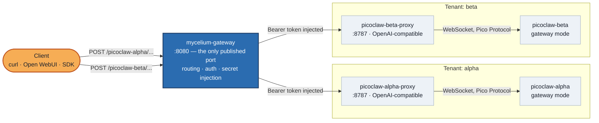

# zombie-crab-project

**Run more than one personal AI agent, safely, behind a single front door.**

*[Leia isso em português](./README.pt-br.md)*

## The problem

[PicoClaw](https://github.com/sipeed/picoclaw) is a fantastic ultra-lightweight
personal AI assistant — a single Go binary, easy to self-host, with a native
real-time chat protocol ("Pico Protocol") over WebSocket. But it was designed
around one idea: **one agent, one owner**. There's no concept of roles,
permissions, or access control between different consumers of the same
deployment. If you spin up a PicoClaw gateway, *anyone who can reach it can
talk to it* — there's no built-in way to say "this API key can call the
sales-team agent" or "that team can only read, not write."

That's fine if you're running PicoClaw for yourself, on your own machine. It
stops being fine the moment you want to:

- Run **more than one** PicoClaw instance (one per team, client, or project)
  from the same host, and
- Expose them over a normal HTTP API (so any OpenAI-compatible client —
  Open WebUI, LangChain, the official OpenAI SDK — can talk to them), while
- Making sure each instance is only reachable through **one controlled,
  authenticated entry point**, not five different ports scattered across
  your firewall rules.

PicoClaw itself has no answer for that last part. This project is the
missing piece.

## The idea

Instead of teaching PicoClaw to do something it was never designed for, we
put a real **API gateway** in front of it — one that already knows how to do
RBAC, secrets, and routing — and let PicoClaw keep doing what it's good at.



Every arrow into a tenant subgraph passes through `mycelium-gateway` first —
there is no other way in.

Three pieces, each doing one job:

| Piece | Job |
|---|---|
| [**PicoClaw**](https://github.com/sipeed/picoclaw) (`picoclaw-alpha`, `picoclaw-beta`, ...) | The actual agent. One instance per tenant/team/use case. Talks only its native Pico Protocol over WebSocket. |
| [**picoclaw-openai-proxy**](https://github.com/sgelias/picoclaw-openai-proxy) | A tiny sidecar that translates a standard OpenAI `/v1/chat/completions` HTTP call into a Pico Protocol WebSocket turn, so any OpenAI-compatible tool can talk to PicoClaw. |
| [**Mycelium**](https://github.com/LepistaBioinformatics/mycelium) (standalone mode) | The API gateway. The *only* thing exposed to the outside world. Everything downstream of it is unreachable except through it. |

None of the PicoClaw instances or their proxy sidecars publish a port to the
host — they only exist inside a private Docker network. If you're not
talking through Mycelium, you're not talking to anything.

## Why Mycelium specifically

This is the part that actually solves the "PicoClaw has no RBAC" problem —
not by adding RBAC to PicoClaw, but by putting something in front of it that
already has it:

- **Zero-dependency to get started.** Mycelium's `standalone` mode runs on
  SQLite and an in-process cache — no Postgres, no Redis, no Vault to stand
  up first. You get a real API gateway with a single `docker compose up`.
- **Secrets never touch the client.** Each downstream route can require a
  secret (a bearer token, in our case) that Mycelium injects on the way to
  the proxy. The caller talking to the gateway never sees it, and the
  proxy sidecar rejects anything that doesn't carry it — so even a stray
  request that somehow reached the internal network directly is turned away.
- **Security groups, built in.** Mycelium routes can be `public`,
  `authenticated`, `protected`, or `protectedByRoles` (with per-role
  read/write permissions). This project's routes are `authenticated`:
  Mycelium validates the caller's token itself and injects their verified
  email as an `x-mycelium-email` header — the proxy reads that and derives
  the PicoClaw session key from it, never from a client-declared field. A
  caller can no longer just put `"user": "someone-else"` in the request body
  and read someone else's conversation — **without ever touching PicoClaw
  itself.** That's the RBAC PicoClaw doesn't have, living in the layer
  that's supposed to have it. (`protected`/`protectedByRoles` — full account
  profile, per-instance role gating — are one config line away, but require
  an account/tenant model this stack doesn't set up yet; see "Sign in from a
  browser instead" below.)
- **One place to look, one place to lock down.** Health checks, routing,
  authentication, and rate limiting for *every* PicoClaw instance live in
  one config file and one container, instead of being reinvented per
  instance.
- **It scales sideways for free.** Adding a third, fourth, or tenth PicoClaw
  instance is copy-paste: a new service pair in `docker-compose.yaml` and a
  new route block in Mycelium's config. The gateway doesn't care how many
  agents are behind it.

## A first-time walkthrough

If you've never touched PicoClaw or Mycelium before, here's the path from
zero to a working request:

**1. Clone, with the submodule:**

```bash
git clone --recurse-submodules https://github.com/sgelias/zombie-crab-project.git
cd zombie-crab-project
```

**2. Onboard each PicoClaw instance once.** The very first boot needs to
generate a `config.json` — do this before the long-running `gateway` service
starts, or it'll crash-loop on an empty config:

```bash
docker compose run --rm picoclaw-alpha
docker compose run --rm picoclaw-beta
```

**3. Pick a model and drop in your API key.** Edit
`data/alpha/config.json` and set `agents.defaults.provider` /
`agents.defaults.model_name` to one of the entries already listed in that
file's `model_list` (DeepSeek, Anthropic, OpenAI, and a couple dozen others
are pre-populated). Then create `data/alpha/.security.yml` with the real
key:

```yaml
model_list:
  deepseek-chat:
    api_keys:
      - "your-real-api-key"
```

**4. Turn on the channel the proxy talks to.** Still in
`data/alpha/config.json`, set `channel_list.pico.enabled` to `true`. Then
give it a token in `.security.yml` — note it has to be **nested** under
`settings`, not flat:

```yaml
channels:
  pico:
    settings:
      token: "some-random-token"
```

Repeat steps 3–4 for `data/beta/`.

**5. Tell Mycelium about those same tokens.** Copy `.env.example` to `.env`
and set `MYC_PICOCLAW_ALPHA_TOKEN` / `MYC_PICOCLAW_BETA_TOKEN` — these are
the bearer tokens Mycelium will inject when calling each proxy, and the
proxy's own `PROXY_API_KEY` check expects the exact same value.

**6. Bring it all up:**

```bash
docker compose up -d
```

**7. Get a Mycelium account and a bearer token.** The routes are
`authenticated`, so an anonymous `curl` won't get past the gateway anymore —
you need a real Mycelium account and its issued token. Easiest path: use
`chat-webapp` (see "Sign in from a browser instead" below) to sign up and
grab the token from its session cookie, or follow Mycelium's own
[authentication flows guide](https://github.com/LepistaBioinformatics/mycelium/blob/main/modules/mycelium-api-gateway/docs/book/src/11-authentication-flows.md)
to register and log in against this same `mycelium-gateway` directly.

**8. Talk to it — through the gateway, on the one port that's published:**

```bash
curl http://localhost:8080/picoclaw-alpha/v1/chat/completions \
  -H "Content-Type: application/json" \
  -H "Authorization: Bearer <your-mycelium-token>" \
  -d '{
    "model": "picoclaw",
    "session_id": "conversa-1",
    "messages": [{"role": "user", "content": "hi"}]
  }'
```

There's no `"user"` field anymore — Mycelium resolves who you are from the
token and injects it; the proxy trusts that, not anything in the body. Swap
`picoclaw-alpha` for `picoclaw-beta` to reach the second instance — same
gateway, same port, completely separate agent underneath.

## Sign in from a browser instead

Two more services exist purely so a human doesn't have to hand-craft curl
requests and bearer tokens:

- **`chat-webapp`** (`http://localhost:${CHAT_WEBAPP_PORT:-3000}`) — a small
  Next.js test client. Sign in with just your email (Mycelium's magic-link
  flow, no password), pick `alpha` or `beta`, and start chatting right
  away — no further setup. It's a BFF: your browser never sees the Mycelium
  JWT, only an httpOnly session cookie — every call to Mycelium happens
  server-side, inside `chat-webapp`'s own container.
- **`mycelium-webapp`** (`http://localhost:${MYCELIUM_WEBAPP_PORT:-8081}`) —
  Mycelium's own official admin UI, built from its upstream repo the same
  way `mycelium-gateway` is (a pinned git commit, no local source copied
  in). Not required for the chat flow above; it's there for account/tenant
  administration if you want to explore Mycelium's own management screens.

**No real SMTP is configured**, so magic-link emails aren't actually
delivered — Mycelium's standalone build logs them instead. After requesting
a code:

```bash
docker compose logs mycelium-gateway | grep -o 'http://localhost:8080/_adm/beginners/users/magic-link/display[^"]*'
```

Open that URL in a browser; it shows the 6-digit code to enter back in
`chat-webapp`.

### Why every signed-up account can already chat with both instances

Routes here are `authenticated`, not `protected`/`protectedByRoles` — on
purpose. Mycelium's account model requires a caller to hold a guest
membership in a tenant-scoped subscription account just to resolve a full
profile at all (the mechanism `protected`/`protectedByRoles` both rely on) —
a freshly self-registered account has none, and would get rejected outright,
regardless of which specific role a route asks for. Building that whole
Staff → tenant → subscription → guest-invite chain (plus migrating this
gateway off SQLite to Postgres, since Mycelium's account-seeding CLI is
Postgres-only) is real setup work, deliberately deferred: this stack
prioritizes "sign in and chat immediately" over "per-instance role
gating" for now. Restricting `picoclaw-alpha` to some accounts and
`picoclaw-beta` to others is a real feature this same gateway supports
(`protectedByRoles`) — just not wired up yet in this repo.

## What's what in this repo

```
docker-compose.yaml       # the whole stack: 2x picoclaw + proxy pairs + gateway + webapps
.env.example              # runtime knobs + per-instance bearer tokens
mycelium/
  Dockerfile.standalone   # builds mycelium-api from upstream git, no local source copied in
  config.standalone.toml  # gateway routes for picoclaw-alpha / picoclaw-beta
picoclaw-openai-proxy/    # git submodule -- the OpenAI-compat sidecar
webapp/                   # Next.js chat test client (BFF -- signin, picker, chat)
mycelium-webapp/          # Dockerfile for Mycelium's own admin UI, built from upstream git
```

## Before you take this to production

This repo is tuned to be easy to read and easy to run locally, not to be a
hardened production deployment out of the box. A few things worth knowing
before you expose it beyond your own machine:

- TLS is disabled between the gateway and its downstream services (they
  all sit on a private Docker network) — terminate TLS at the edge if
  `mycelium-gateway`'s port ever faces the internet. `chat-webapp`'s own
  session cookie is intentionally not marked `Secure` for the same reason
  (plain HTTP throughout this stack) — turn that back on once you put TLS
  in front of it.
- Rotate the bearer tokens in `.env` and `.security.yml` before sharing this
  stack with anyone else, and never commit real values (both are already
  gitignored).
