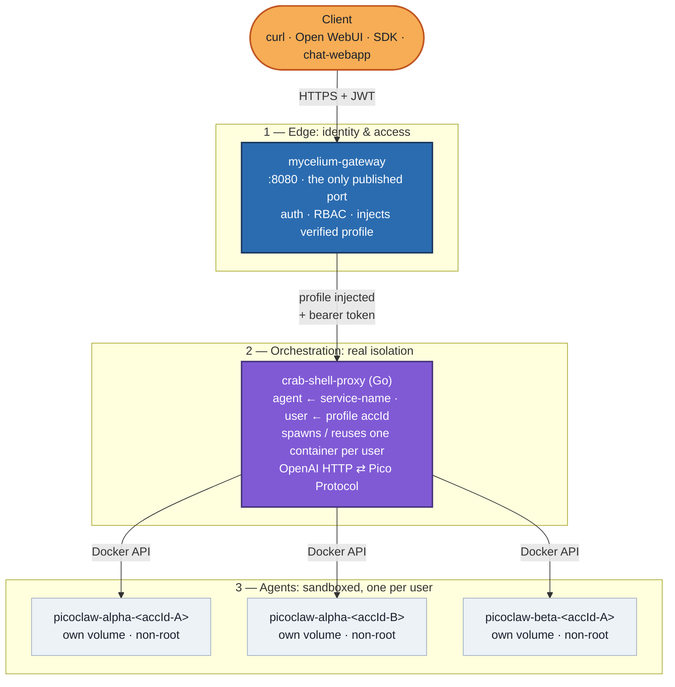

# zombie-crab-project

**Give every user their own real, isolated AI agent — behind a single, authenticated front door.**

*[Leia isso em português](./README.pt-br.md)*

## The problem

[PicoClaw](https://github.com/sipeed/picoclaw) is a fantastic ultra-lightweight
personal AI assistant — a single Go binary, easy to self-host, with a native
real-time chat protocol ("Pico Protocol") over WebSocket. But it was designed
around one idea: **one agent, one owner**. There's no concept of roles,
permissions, or isolation between different consumers of the same deployment.
If you spin up a PicoClaw gateway, *anyone who can reach it can talk to it*, and
everyone who does **shares the same process, the same filesystem, and the same
memory**.

That's fine on your own laptop. It stops being fine the moment more than one
person is involved, because an AI agent reads and writes files, runs tools,
executes code, and keeps long-lived memory — all steered by untrusted natural
language. In a shared process, one prompt-injection, one path-traversal bug, or
one leaky tool is enough for **one user to read another user's conversations,
files, and secrets**.

So there are really two problems to solve at once:

1. **Access** — expose PicoClaw over a normal, authenticated HTTP API (so any
   OpenAI-compatible client can use it) through **one controlled entry point**,
   not a handful of ports scattered across your firewall.
2. **Isolation** — make each user's agent a *real* boundary, so a compromise of
   one never becomes a compromise of everyone.

PicoClaw answers neither on its own. This project is the missing structure
around it.

## The structure (and why it's shaped this way)

Rather than bolt multi-tenancy onto PicoClaw, the stack is **three layers, each
doing exactly one job** — a deliberate separation that is the whole point of the
project:



| Layer | Component | Its one job |
|---|---|---|
| **1 · Edge** | [**Mycelium**](https://github.com/LepistaBioinformatics/mycelium) (standalone) | The only thing exposed. Authenticates the caller, enforces RBAC, and injects a **verified, unforgeable** account profile into the request. Nothing downstream is reachable except through it. |
| **2 · Orchestration** | [**crab-shell-proxy**](https://github.com/LepistaBioinformatics/crab-shell-proxy) (Go) | Reads the agent from the injected service name and the user from the profile's `accId`, then ensures that user's own PicoClaw container is running — spinning it up on demand, tearing it down when idle. Speaks OpenAI HTTP outward and Pico Protocol inward. |
| **3 · Agent** | [**PicoClaw**](https://github.com/sipeed/picoclaw) | The actual assistant, one **isolated, non-root container per `(agent, user)`**, with its own volume for workspace, memory, and sessions. |

**Why this separation matters — it's defense in depth, and the isolation is real:**

- **The edge never trusts the client's word about *who* they are.** Mycelium
  verifies the token and injects the account profile server-side; the caller
  cannot claim to be someone else. Identity flows *down* from a trusted source,
  never *up* from the request body.
- **Isolation is enforced by the kernel, not by application code.** Each user
  gets a separate container (process, network, and mount namespaces) and a
  separate volume — not a filtered view of a shared store. If user A's agent is
  fully compromised (prompt-injected into running hostile code, say), it still
  **cannot read user B's files, memory, or conversations**: different container,
  different volume, non-root, no shared surface. That is the difference between
  *"isolated"* and isolated.
- **The identity is the account, not the email.** Users are keyed on the
  profile's `accId` (a stable, unique account id) — emails are mutable and are
  kept only as a human-readable marker for operators. Change your email; your
  agent and its history stay yours.
- **Each layer is replaceable and auditable on its own.** Auth/RBAC lives in one
  gateway config; isolation and lifecycle live in one small Go service;
  the agent stays the stock PicoClaw binary, unmodified. One place to reason
  about each concern.

### Lifecycle: scale-to-zero and continuous

Per-user containers don't run forever. Each agent is configured for one of two
modes:

- **scale-to-zero** — the container cold-starts on the user's first request and
  is stopped after a configurable idle window (data preserved), freeing RAM.
  Ideal for API-only usage.
- **continuous** — never auto-stopped. Required when the agent is also reached
  through PicoClaw's **native connectors** (Telegram, MS Teams, …), which dial
  *out* from inside the container and don't pass through the proxy, so the
  proxy can't see that activity to keep it alive.

## A first-time walkthrough

From zero to a working, isolated agent:

**1. Clone, with submodules:**

```bash
git clone --recurse-submodules https://github.com/LepistaBioinformatics/zombie-crab-project.git
cd zombie-crab-project
```

**2. (Optional) Pre-seed a template per agent.** You can skip this — the proxy
**auto-bootstraps** a default picoclaw template the first time a user chats if
`data/templates/<agent>/` is missing, so a fresh checkout works out of the box.
Pre-seed only when you want a **custom persona/skills** from the start:

```bash
for a in alpha beta; do
  mkdir -p "data/templates/$a"
  docker run --rm -v "$PWD/data/templates/$a":/root/.picoclaw \
    docker.io/sipeed/picoclaw:latest >/dev/null 2>&1 || true
done
```

crab-shell-proxy clones the template (yours or the embedded default) into each
new user's dir and injects the provider/model, a fresh pico-channel token, and
the API key at provisioning time — so the template stays a bare, secret-free
scaffold. See [Creating a Custom Agent](./docs/CREATE_CUSTOM_AGENT.md) to shape
a template, and [Running and resetting from scratch](#running-and-resetting-from-scratch)
for the self-heal behavior.

**3. Configure `.env`.** Copy the matching `deploy/<mode>/.env.example` (standalone / prod / dokploy) to `.env` and set:

- `MYC_PICOCLAW_ALPHA_TOKEN` / `MYC_PICOCLAW_BETA_TOKEN` — bearer tokens Mycelium
  injects and crab-shell-proxy validates per agent.
- `PICOCLAW_ALPHA_API_KEY` / `PICOCLAW_BETA_API_KEY` — each agent's **own** LLM
  key, read from the environment (never stored in config or images).
- `MYC_STANDALONE_BOOTSTRAP_SECRET` — gates the one-time Staff bootstrap.

Which provider/model each agent uses is declared in
[`crab/crab-shell-proxy/config.yaml`](./crab/crab-shell-proxy/config.yaml) (e.g.
`deepseek` / `deepseek-chat`), pointing at the env var above.

**4. Bring it up:**

```bash
docker compose up -d --build
```

**5. Claim the Staff account (once).** Open
`http://localhost:${MYCELIUM_PORT:-8080}/_adm/instance/bootstrap`, submit the
bootstrap secret + your email, and read the 6-digit code from the gateway log
(standalone logs magic-link emails instead of sending them):

```bash
docker compose logs mycelium-gateway | grep -i bootstrap
```

**6. Sign in and chat.** Open **`chat-webapp`**
(`http://localhost:${CHAT_WEBAPP_PORT:-3000}`), sign in with your email
(magic-link, no password), pick an agent, and chat. Your first message
cold-starts *your own* container; `docker ps` will show
`picoclaw-alpha-<your-accId>` running as a non-root user.

> The gateway routes are `protectedByRoles` (roles `alpha` / `beta`), so an
> account must hold the matching guest-role to reach an instance. Assigning
> roles is done from **`mycelium-webapp`**
> (`http://localhost:${MYCELIUM_WEBAPP_PORT:-8081}`) — Mycelium's own admin UI —
> via the Staff → tenant → subscription → guest-invite flow.

## Running and resetting from scratch

The walkthrough above brings up a clean stack. To **reset an existing
environment to zero** — wipe every per-user agent and all templates, and let the
stack rebuild itself — stop the stack, remove the proxy-spawned containers, wipe
the on-disk state, and rebuild:

```bash
docker compose down
docker rm -f $(docker ps -aq --filter 'name=picoclaw') 2>/dev/null   # agents spawned outside compose

# on-disk state is owned by the spawned (non-root) agents -> sudo
sudo rm -rf data/templates data/tenants data/effective-secrets \
            data/effective-skills data/user-secrets data/registered-models

docker compose up -d --build   # --build is REQUIRED: the fallback template is baked into the proxy binary
```

Then sign in and send a message — the proxy re-provisions your user from
scratch. The Postgres volume (Mycelium accounts/roles) is **separate** and is
not wiped, so your login survives; add `-v` to `docker compose down` only if you
also want to reset accounts (you'd then re-run the Staff bootstrap).

**Why no manual recovery is needed:** the proxy **auto-bootstraps** a missing
`data/templates/<agent>/` from a default template **embedded in its binary**, so
a wiped `data/` self-heals on the next chat — no `picoclaw onboard` step. The
per-agent model and key are re-applied from `config.yaml` + `.env` on every
provision, so the agent also responds again immediately. To customize the
embedded default, edit
`crab/crab-shell-proxy/internal/docker/defaulttemplate/<harness>/` (today:
`picoclaw`) and rebuild.

## Day-2 administration

Managing models, shared skills, shared secrets, files, members, and branding is
done from the **chat-webapp admin area** — see the
[Admin Guide](./docs/ADMIN_GUIDE.md).

## What's in this repo

```
docker-compose.yaml        # the whole stack (gateway + crab-shell-proxy + webapps + db)
deploy/                    # per-mode configs: .env examples + mycelium/proxy configs (standalone / prod / dokploy)
crab/                      # the crab side (per-user isolation + its chat client)
  crab-shell-proxy/        # git submodule — the Go per-user isolation orchestrator
  crab-exoskeleton-webapp/ # git submodule — the Next.js chat client (BFF)
fungi/                     # the mycelium side (gateway + its admin UI)
  mycelium/
    Dockerfile.standalone  # builds mycelium-api from upstream git (no local source)
  mycelium-webapp/         # Dockerfile for Mycelium's own admin UI (from upstream git)
docs/                      # task guides (creating a custom agent · admin guide)
data/                      # per-agent templates + per-user volumes + shared material (gitignored)
  templates/<agent>/       #   template cloned into each new user (auto-bootstrapped if missing)
  tenants/…                #   per-(agent,user) isolated volumes
```

`crab-shell-proxy` is a submodule with its own
[README](./crab/crab-shell-proxy/README.md) going deeper on the isolation model.

The [`docs/`](./docs/) folder holds guides for common tasks —
[**Creating a Custom Agent**](./docs/CREATE_CUSTOM_AGENT.md) and the
[**Admin Guide**](./docs/ADMIN_GUIDE.md) (models, skills, secrets, members).

## Before you take this to production

Tuned to be easy to read and run locally, not hardened out of the box:

- **crab-shell-proxy holds the Docker socket** and runs as root — it is the most
  privileged component (it can control the host daemon) and is the trusted
  control plane; the agents it spawns are the non-root, sandboxed part. Isolate
  the socket (a restricted socket-proxy, a dedicated host) before exposing this.
- **TLS is disabled** between the gateway and its private-network downstreams —
  terminate TLS at the edge if `mycelium-gateway`'s port ever faces the
  internet, and re-enable `chat-webapp`'s `Secure` session cookie.
- **Rotate secrets** in `.env` (bearer tokens, LLM keys, bootstrap secret)
  before sharing this stack; real values are gitignored — keep them that way.
