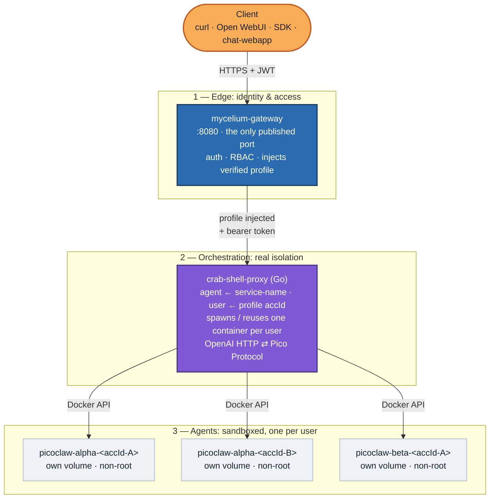

# zombie-crab-project

**Give every user their own real, isolated AI agent — behind a single, authenticated front door.**

*[Leia isso em português](./README.pt-br.md)*

## The problem

[PicoClaw](https://github.com/sipeed/picoclaw) is a fantastic ultra-lightweight
personal AI assistant — a single Go binary, easy to self-host, with a native
real-time chat protocol ("Pico Protocol") over WebSocket. But it was designed
around one idea: **one agent, one owner**. There's no concept of roles,
permissions, or isolation between different consumers of the same deployment.
If you spin up a PicoClaw gateway, *anyone who can reach it can talk to it*, and
everyone who does **shares the same process, the same filesystem, and the same
memory**.

That's fine on your own laptop. It stops being fine the moment more than one
person is involved, because an AI agent reads and writes files, runs tools,
executes code, and keeps long-lived memory — all steered by untrusted natural
language. In a shared process, one prompt-injection, one path-traversal bug, or
one leaky tool is enough for **one user to read another user's conversations,
files, and secrets**.

So there are really two problems to solve at once:

1. **Access** — expose PicoClaw over a normal, authenticated HTTP API (so any
   OpenAI-compatible client can use it) through **one controlled entry point**,
   not a handful of ports scattered across your firewall.
2. **Isolation** — make each user's agent a *real* boundary, so a compromise of
   one never becomes a compromise of everyone.

PicoClaw answers neither on its own. This project is the missing structure
around it.

## The structure (and why it's shaped this way)

Rather than bolt multi-tenancy onto PicoClaw, the stack is **three layers, each
doing exactly one job** — a deliberate separation that is the whole point of the
project:


```mermaid
flowchart TB
    client(["Client<br/>curl · Open WebUI · SDK · chat-webapp"])

    subgraph edge [1 — Edge: identity & access]
        myc["mycelium-gateway<br/>:8080 · the only published port<br/>auth · RBAC · injects verified profile"]
    end

    subgraph orch [2 — Orchestration: real isolation]
        crab["crab-shell-proxy (Go)<br/>agent ← service-name · user ← profile accId<br/>spawns / reuses one container per user<br/>OpenAI HTTP ⇄ Pico Protocol"]
    end

    subgraph agents [3 — Agents: sandboxed, one per user]
        direction LR
        u1["picoclaw-alpha-&lt;accId-A&gt;<br/>own volume · non-root"]
        u2["picoclaw-alpha-&lt;accId-B&gt;<br/>own volume · non-root"]
        u3["picoclaw-beta-&lt;accId-A&gt;<br/>own volume · non-root"]
    end

    client -->|HTTPS + JWT| myc
    myc -->|profile injected<br/>+ bearer token| crab
    crab -->|Docker API| u1
    crab -->|Docker API| u2
    crab -->|Docker API| u3

    classDef gateway fill:#2b6cb0,color:#fff,stroke:#1a365d,stroke-width:2px;
    classDef orchStyle fill:#805ad5,color:#fff,stroke:#44337a,stroke-width:2px;
    classDef clientStyle fill:#f6ad55,color:#1a202c,stroke:#c05621,stroke-width:2px;
    classDef agentStyle fill:#edf2f7,stroke:#a0aec0,color:#1a202c;
    class myc gateway;
    class crab orchStyle;
    class client clientStyle;
    class u1,u2,u3 agentStyle;
```

| Layer | Component | Its one job |
|---|---|---|
| **1 · Edge** | [**Mycelium**](https://github.com/LepistaBioinformatics/mycelium) (standalone) | The only thing exposed. Authenticates the caller, enforces RBAC, and injects a **verified, unforgeable** account profile into the request. Nothing downstream is reachable except through it. |
| **2 · Orchestration** | [**crab-shell-proxy**](https://github.com/LepistaBioinformatics/crab-shell-proxy) (Go) | Reads the agent from the injected service name and the user from the profile's `accId`, then ensures that user's own PicoClaw container is running — spinning it up on demand, tearing it down when idle. Speaks OpenAI HTTP outward and Pico Protocol inward. |
| **3 · Agent** | [**PicoClaw**](https://github.com/sipeed/picoclaw) | The actual assistant, one **isolated, non-root container per `(agent, user)`**, with its own volume for workspace, memory, and sessions. |

**Why this separation matters — it's defense in depth, and the isolation is real:**

- **The edge never trusts the client's word about *who* they are.** Mycelium
  verifies the token and injects the account profile server-side; the caller
  cannot claim to be someone else. Identity flows *down* from a trusted source,
  never *up* from the request body.
- **Isolation is enforced by the kernel, not by application code.** Each user
  gets a separate container (process, network, and mount namespaces) and a
  separate volume — not a filtered view of a shared store. If user A's agent is
  fully compromised (prompt-injected into running hostile code, say), it still
  **cannot read user B's files, memory, or conversations**: different container,
  different volume, non-root, no shared surface. That is the difference between
  *"isolated"* and isolated.
- **The identity is the account, not the email.** Users are keyed on the
  profile's `accId` (a stable, unique account id) — emails are mutable and are
  kept only as a human-readable marker for operators. Change your email; your
  agent and its history stay yours.
- **Each layer is replaceable and auditable on its own.** Auth/RBAC lives in one
  gateway config; isolation and lifecycle live in one small Go service;
  the agent stays the stock PicoClaw binary, unmodified. One place to reason
  about each concern.

### Lifecycle: scale-to-zero and continuous

Per-user containers don't run forever. Each agent is configured for one of two
modes:

- **scale-to-zero** — the container cold-starts on the user's first request and
  is stopped after a configurable idle window (data preserved), freeing RAM.
  Ideal for API-only usage.
- **continuous** — never auto-stopped. Required when the agent is also reached
  through PicoClaw's **native connectors** (Telegram, MS Teams, …), which dial
  *out* from inside the container and don't pass through the proxy, so the
  proxy can't see that activity to keep it alive.

## A first-time walkthrough

From zero to a working, isolated agent:

**1. Clone, with submodules:**

```bash
git clone --recurse-submodules https://github.com/LepistaBioinformatics/zombie-crab-project.git
cd zombie-crab-project
```

**2. (Optional) Pre-seed a template per agent.** You can skip this — the proxy
**auto-bootstraps** a default picoclaw template the first time a user chats if
`data/templates/<agent>/` is missing, so a fresh checkout works out of the box.
Pre-seed only when you want a **custom persona/skills** from the start:

```bash
for a in alpha beta; do
  mkdir -p "data/templates/$a"
  docker run --rm -v "$PWD/data/templates/$a":/root/.picoclaw \
    docker.io/sipeed/picoclaw:latest >/dev/null 2>&1 || true
done
```

crab-shell-proxy clones the template (yours or the embedded default) into each
new user's dir and injects the provider/model, a fresh pico-channel token, and
the API key at provisioning time — so the template stays a bare, secret-free
scaffold. See [Creating a Custom Agent](./docs/CREATE_CUSTOM_AGENT.md) to shape
a template, and [Running and resetting from scratch](#running-and-resetting-from-scratch)
for the self-heal behavior.

**3. Configure `.env`.** Copy the matching `deploy/<mode>/.env.example` (standalone / prod / dokploy — see [Deploy modes](#deploy-modes)) to `.env` at the repo root and set:

- `MYC_PICOCLAW_ALPHA_TOKEN` / `MYC_PICOCLAW_BETA_TOKEN` — bearer tokens Mycelium
  injects and crab-shell-proxy validates per agent.
- `PICOCLAW_ALPHA_API_KEY` / `PICOCLAW_BETA_API_KEY` — each agent's **own** LLM
  key, read from the environment (never stored in config or images).
- `MYC_STANDALONE_BOOTSTRAP_SECRET` — gates the one-time Staff bootstrap.

The stack ships two agents, `alpha` and `beta`, both picoclaw. Each needs its
token and its LLM key set, or the proxy will not start — add or remove agents in
the proxy's `config.yaml` together with the matching Gateway service block.

Which provider/model each agent uses is declared in
[`crab/crab-shell-proxy/config.yaml`](./crab/crab-shell-proxy/config.yaml) (e.g.
`deepseek` / `deepseek-chat`), pointing at the env var above.

**4. Bring it up:**

```bash
docker compose up -d --build
```

**5. Claim the Staff account (once).** Open
`http://localhost:${MYCELIUM_PORT:-8080}/_adm/instance/bootstrap`, submit the
bootstrap secret + your email, and read the 6-digit code from the gateway log
(standalone logs magic-link emails instead of sending them):

```bash
docker compose logs mycelium-gateway | grep -i bootstrap
```

**6. Sign in and chat.** Open **`chat-webapp`**
(`http://localhost:${CHAT_WEBAPP_PORT:-3000}`), sign in with your email
(magic-link, no password), pick an agent, and chat. Your first message
cold-starts *your own* container; `docker ps` will show
`crabshell-alpha-<hash>` running as a non-root user (the hash is the
tenant + subscription + account triple — a container name has a 63-char limit,
so the identity lives in the container's labels, not in its name).

> The gateway routes are `protectedByRoles` (roles `alpha` / `beta`), so an
> account must hold the matching guest-role to reach an
> instance. Roles can be granted from the **chat-webapp admin area**
> (Members → invite) or from **`mycelium-webapp`**
> (`http://localhost:${MYCELIUM_WEBAPP_PORT:-8081}`) — Mycelium's own admin UI —
> via the Staff → tenant → subscription → guest-invite flow.

## In the chat client

What a signed-in member gets, beyond the conversation itself. The right-hand
**Workspace** panel holds four sections; the left sidebar switches between
workspaces and that workspace's conversations.

**Scheduled tasks** (Workspace → Tasks). Ask the agent to do something on a
schedule — "compile a report every evening at six" — and it will, unattended.
The panel lists what is scheduled, its cron expression or interval, whether it is
enabled, and when it last and next runs. Each task expands to its past
executions (the three most recent, then *show more*), and opening one renders
that run's whole transcript: the prompt it woke up with, every tool call, and
what it produced. A **reference in chat** action drops a one-line marker for a
task or a single run into the composer, so you can ask the agent about it.

Three things about it are worth stating plainly, because they are deliberate and
a reader would otherwise go looking for controls that do not exist:

- **It is read-only.** Creating, changing, disabling or deleting a task is done
  by asking the agent. picoclaw owns the job store and holds the live schedule in
  memory, and whether it reloads a store edited from outside is unverified — so a
  toggle in the panel could disagree with the timers actually running.
- **There is no per-run success mark.** No outcome is recorded per execution
  anywhere. A run shows its instant, how long it took and how much it logged;
  the task shows picoclaw's own status for its most recent run and nothing more.
- **Finished one-off tasks are hidden by default**, behind a switch that always
  says how many rows it is hiding. A recurring task is never hidden, even
  disabled — disabling is reversible, and hiding it would read as deletion.

**Picking a workspace.** With none selected, the chat area itself becomes the
picker: one row per tenant, a box per subscription inside it, and the agents you
can reach as tiles showing their permissions (an eye for read, a pencil for
write). Clicking one opens a fresh conversation with it.

**The collapsed sidebar.** Collapsing the left sidebar leaves a rail with an icon
per panel; the active one is filled, and hovering the rail previews the panel
without pinning it open. The circled arrow is what opens and closes it.

Also on this surface: **workspace memory** (a file the agent reads on every
message), the **knowledge graph** it builds on its own, and **files** you attach
from the composer — see the landing page at `/` for what each is for.

> Operator note: these read routes live on crab-shell-proxy at `/v1/cron/*`, so
> the gateway needs a matching `[[<agent>.path]]` block or it answers
> `400 "Request path does not match any service"` before the proxy is reached.
> All three profiles under [`deploy/`](./deploy/) already carry it, one block per
> agent.

## Running and resetting from scratch

The walkthrough above brings up a clean stack. To **reset an existing
environment to zero** — wipe every per-user agent and all templates, and let the
stack rebuild itself — stop the stack, remove the proxy-spawned containers, wipe
the on-disk state, and rebuild:

```bash
docker compose down
docker rm -f $(docker ps -aq --filter 'name=crabshell') 2>/dev/null   # agents spawned outside compose

# on-disk state is owned by the spawned (non-root) agents -> sudo
sudo rm -rf data/templates data/tenants data/effective-secrets \
            data/effective-skills data/user-secrets data/registered-models

docker compose up -d --build   # --build is REQUIRED: the fallback template is baked into the proxy binary
```

Then sign in and send a message — the proxy re-provisions your user from
scratch. Accounts and roles live in the named volumes, **not** in `data/`, so
they are not wiped: in standalone that is `mycelium-data` (Mycelium's SQLite
database), plus `chat-webapp-postgres-data` for the conversation list. Your
login survives; add `-v` to `docker compose down` only if you also want to reset
accounts (you'd then re-run the Staff bootstrap).

**Why no manual recovery is needed:** the proxy **auto-bootstraps** a missing
`data/templates/<agent>/` from a default template **embedded in its binary**, so
a wiped `data/` self-heals on the next chat — no `picoclaw onboard` step. The
per-agent model and key are re-applied from `config.yaml` + `.env` on every
provision, so the agent also responds again immediately. To customize the
embedded default, edit
`crab/crab-shell-proxy/internal/docker/defaulttemplate/<harness>/` (today:
`picoclaw`) and rebuild.

## Deploy modes

Three profiles live side by side. Each has a directory under `deploy/` holding
its `.env.example` and the gateway config that mode mounts — copy the matching
`.env.example` to `.env` at the repo root and use that mode's compose command.

| | **standalone** (default) | **prod** | **dokploy** |
|---|---|---|---|
| Compose | `docker compose up -d` | `docker compose -f docker-compose.yaml -f docker-compose.prod.yaml up -d` | `docker compose -f docker-compose.dokploy.yaml up -d` (or point Dokploy at this repo + file) |
| Mycelium | built from source (`MYCELIUM_GIT_REF`) | published image (`MYCELIUM_IMAGE_TAG`) | published image (`MYCELIUM_IMAGE_TAG`) |
| Storage | SQLite in `mycelium-data` | `mycelium-postgres` | `mycelium-postgres` |
| E-mail | stub — magic links land in the log | real SMTP | real SMTP |
| Ingress | published host ports | published host ports | Traefik, one domain per service |
| Agents | alpha · beta | alpha · beta | alpha · beta |
| Gateway config | `deploy/standalone/config.standalone.toml` | `deploy/prod/config.base.toml` | `deploy/dokploy/config.base.toml` |
| Agent catalog | baked in the proxy image | baked in the proxy image | mounted: `deploy/dokploy/crab-shell-proxy.config.yaml` |

All three pin the **same Mycelium release**: standalone builds the commit tagged
`9.0.0-rc.13`, prod and dokploy pull `MYCELIUM_IMAGE_TAG=9.0.0-rc.13`. Move them
together — the gateway config is shared vocabulary, and a version skew between
what you test and what you deploy is exactly where it breaks.

### One-time database schema (prod and dokploy only)

The Postgres backend has **no embedded migrations** (SQLite does), so the schema
has to be applied once, after the first `up`. It takes **two steps**: upstream's
`up.sql`, then the migration scripts `up.sql` does *not* fold in. Get both from
the mycelium repo at the tag this deploy pins:

```bash
git clone --depth 1 --branch 9.0.0-rc.13 \
  https://github.com/LepistaBioinformatics/mycelium.git /tmp/myc
cd /path/to/zombie-crab-project && set -a; . ./.env; set +a

# 1) base schema
docker compose -f docker-compose.yaml -f docker-compose.prod.yaml exec -T mycelium-postgres \
  psql -U "$MYC_DB_USER" -d postgres \
       -v db_name="$MYC_DB_NAME" -v db_user="$MYC_DB_USER" \
       -v db_password="$MYC_DB_PASSWORD" -v db_role=service-role-mycelium \
  < /tmp/myc/adapters/diesel_postgres/sql/up.sql

# 2) the migrations, in filename order
for m in /tmp/myc/adapters/diesel_postgres/sql/migrations/*.sql; do
  docker compose -f docker-compose.yaml -f docker-compose.prod.yaml exec -T mycelium-postgres \
    psql -U "$MYC_DB_USER" -d "$MYC_DB_NAME" < "$m"
done
```

Step 1 creates the database if missing, `\c`s into it, then creates the roles and
tables; it **requires** `-v db_password`. Compose already created the database
**and** the login role, so `CREATE USER … already exists` is expected and
harmless — psql keeps going.

Step 2 is not optional at `9.0.0-rc.13`: `up.sql` at this tag ships `kv_artifact`
and the `message_queue` claim index, but **not** `instance_settings`,
`resource_audit_log`, or the `tenant.encrypted_dek` / `kek_version` columns
(envelope encryption) — those exist only as migrations. Verify with `\dt` (you
should see `instance_settings` and `resource_audit_log`) and
`\d tenant` (`encrypted_dek`, `kek_version`). For Dokploy, run the same two steps
via `docker exec` on the `mycelium-postgres` container.

### Before a prod or dokploy deploy

- **`CRAB_HOST_DATA_ROOT`** — must be an absolute **host** path. crab-shell-proxy
  hands it to the host Docker daemon as the bind-mount source for the agent
  containers it spawns, so a path inside the proxy won't resolve.
- **prod / `deploy/prod/config.base.toml`** — set `noreplyEmail` and
  `supportEmail` to `MYC_SMTP_USERNAME` (Gmail rejects a mismatched `From`).
  `domainUrl` / `allowedOrigins` ship pointing at the localhost origins this mode
  actually serves; if you front it with a hostname, change them **together with**
  `mycelium-webapp`'s `VITE_MYCELIUM_API_URL` build arg — the admin UI is a
  browser-side SPA that calls the gateway directly, so a mismatch is a CORS wall.
- **dokploy / `deploy/dokploy/config.base.toml`** — replace the `►►► REPLACE`
  lines with your real `https://` origins (they must match `MYCELIUM_DOMAIN` and
  `MYCELIUM_WEBAPP_DOMAIN`), and remember `dokploy-network` must already exist.
- **Agent catalog** — dokploy mounts `deploy/dokploy/crab-shell-proxy.config.yaml`,
  so agents can be added or dropped there without rebuilding the proxy image.
  standalone and prod use the catalog baked into the image
  (`crab/crab-shell-proxy/config.yaml`).
- **Account webhook (optional)** — registering mycelium's
  `subscriptionAccount.created` webhook makes the proxy scaffold a subscription's
  workspace root up front instead of on the member's first chat. Over JSON-RPC
  (`POST /_adm/rpc`, Staff token), method `systemManager.webhooks.create`:
  `{"name": "crab-shell-proxy", "url": "http://crab-shell-proxy:8080/v1/accounts",
  "trigger": "subscriptionAccount.created", "method": "POST", "secret":
  {"authorizationHeader": {"headerName": "Authorization", "prefix": "Bearer",
  "token": "<CRAB_WEBHOOK_SECRET>"}}}`.

## Day-2 administration

Managing models, shared skills, shared secrets, files, personas, members, and
branding is done from the **chat-webapp admin area** — see the
[Admin Guide](./docs/ADMIN_GUIDE.md).

## What's in this repo

```
docker-compose.yaml        # the whole stack, standalone/default (gateway + crab-shell-proxy + webapps + db)
docker-compose.prod.yaml   # prod overlay: published images + mycelium in Postgres mode (-f with the above)
docker-compose.dokploy.yaml# self-contained Traefik/Dokploy file (base + prod + ingress already merged)
deploy/                    # per-mode configs: .env examples + mycelium/proxy configs (standalone / prod / dokploy)
crab/                      # the crab side (per-user isolation + its chat client)
  crab-shell-proxy/        # git submodule — the Go per-user isolation orchestrator
  crab-exoskeleton-webapp/ # git submodule — the Next.js chat client (BFF)
fungi/                     # the mycelium side (gateway + its admin UI)
  mycelium/
    Dockerfile.standalone  # builds mycelium-api from upstream git (no local source)
  mycelium-webapp/         # Dockerfile for Mycelium's own admin UI (from upstream git)
docs/                      # task guides (creating a custom agent · admin guide)
data/                      # per-agent templates + per-user volumes + shared material (gitignored)
  templates/<agent>/       #   template cloned into each new user (auto-bootstrapped if missing)
  tenants/…                #   per-(agent,user) isolated volumes
```

`crab-shell-proxy` is a submodule with its own
[README](./crab/crab-shell-proxy/README.md) going deeper on the isolation model.

The [`docs/`](./docs/) folder holds guides for common tasks —
[**Creating a Custom Agent**](./docs/CREATE_CUSTOM_AGENT.md) and the
[**Admin Guide**](./docs/ADMIN_GUIDE.md) (models, skills, secrets, members).

## Before you take this to production

Tuned to be easy to read and run locally, not hardened out of the box:

- **crab-shell-proxy holds the Docker socket** and runs as root — it is the most
  privileged component (it can control the host daemon) and is the trusted
  control plane; the agents it spawns are the non-root, sandboxed part. Isolate
  the socket (a restricted socket-proxy, a dedicated host) before exposing this.
- **TLS is disabled** between the gateway and its private-network downstreams —
  terminate TLS at the edge if `mycelium-gateway`'s port ever faces the
  internet, and re-enable `chat-webapp`'s `Secure` session cookie.
- **Rotate secrets** in `.env` (bearer tokens, LLM keys, bootstrap secret)
  before sharing this stack; real values are gitignored — keep them that way.

## License

Licensed under either of

- Apache License, Version 2.0 ([`LICENSE-APACHE`](./LICENSE-APACHE) or
  <http://www.apache.org/licenses/LICENSE-2.0>)
- MIT license ([`LICENSE-MIT`](./LICENSE-MIT) or
  <http://opensource.org/licenses/MIT>)

at your option.

Unless you explicitly state otherwise, any contribution intentionally submitted
for inclusion in this project by you, as defined in the Apache-2.0 license,
shall be dual licensed as above, without any additional terms or conditions.

This covers **this repository's own contents** — the compose files, the deploy
configs, the docs, and the `fungi/` build overlays. The two submodules under
`crab/` carry their own copies of the same dual license. The third-party
components this stack builds and runs are under their own terms and are *not*
relicensed by anything here — in particular
[mycelium](https://github.com/LepistaBioinformatics/mycelium) and its admin UI,
which the `fungi/` Dockerfiles fetch from upstream at image-build time, are
distributed under the Apache License 2.0 **with the Commons Clause**, which is
more restrictive than either license above. Check each upstream project before
redistributing or offering the assembled stack commercially.
