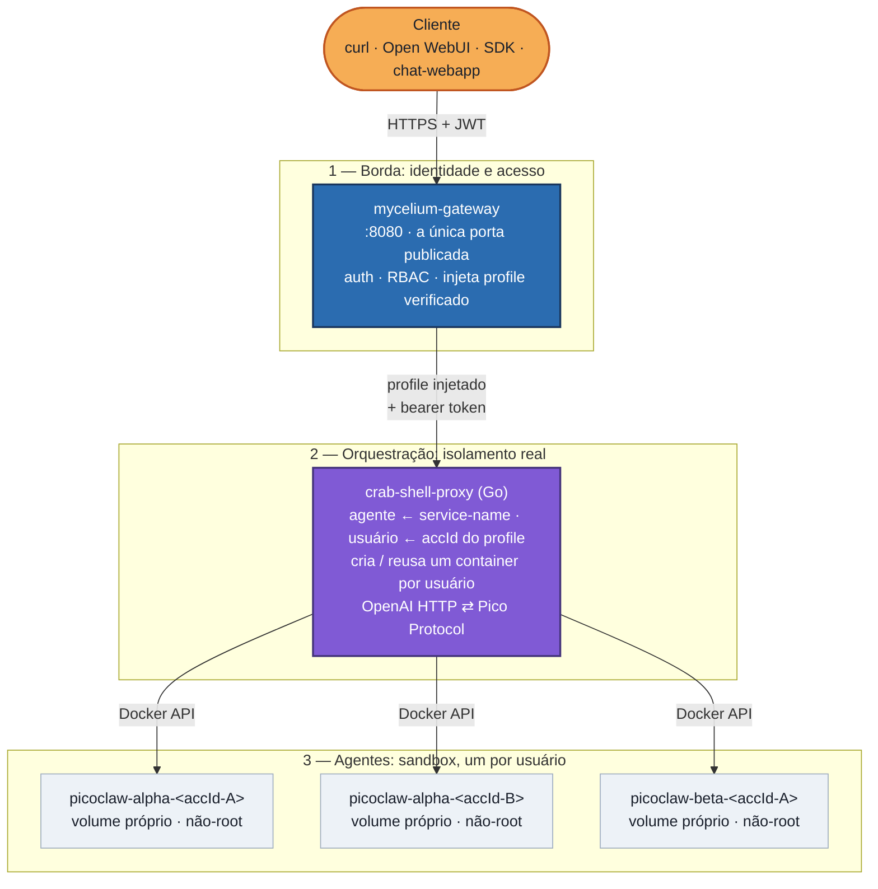

# zombie-crab-project

**Dê a cada usuário o seu próprio agente de IA real e isolado — atrás de uma única porta de entrada autenticada.**

*[Read this in English](./README.md)*

## O problema

O [PicoClaw](https://github.com/sipeed/picoclaw) é um assistente pessoal de IA
ultraleve e excelente — um único binário Go, fácil de auto-hospedar, com um
protocolo de chat em tempo real nativo ("Pico Protocol") sobre WebSocket. Mas
ele foi desenhado em torno de uma ideia: **um agente, um dono**. Não há conceito
de papéis, permissões ou isolamento entre diferentes consumidores do mesmo
deployment. Se você sobe um gateway PicoClaw, *qualquer um que o alcança pode
conversar com ele*, e todos que o fazem **compartilham o mesmo processo, o mesmo
sistema de arquivos e a mesma memória**.

Isso está ótimo no seu laptop. Deixa de estar no instante em que há mais de uma
pessoa envolvida, porque um agente de IA lê e escreve arquivos, roda
ferramentas, executa código e mantém memória de longo prazo — tudo guiado por
linguagem natural não-confiável. Num processo compartilhado, um único
prompt-injection, um bug de path-traversal ou uma ferramenta vazada bastam para
**um usuário ler as conversas, arquivos e segredos de outro**.

Então há, na verdade, dois problemas a resolver de uma vez:

1. **Acesso** — expor o PicoClaw por uma API HTTP normal e autenticada (para que
   qualquer cliente compatível com OpenAI possa usá-lo) através de **um ponto de
   entrada controlado**, e não de várias portas espalhadas pelo firewall.
2. **Isolamento** — fazer do agente de cada usuário uma fronteira *real*, de modo
   que o comprometimento de um nunca se torne o comprometimento de todos.

O PicoClaw não responde a nenhum dos dois sozinho. Este projeto é a estrutura
que falta ao redor dele.

## A estrutura (e por que ela tem esse formato)

Em vez de enfiar multi-tenancy no PicoClaw, a stack é composta por **três
camadas, cada uma fazendo exatamente um trabalho** — uma separação deliberada que
é o cerne do projeto:



| Camada | Componente | Seu único trabalho |
|---|---|---|
| **1 · Borda** | [**Mycelium**](https://github.com/LepistaBioinformatics/mycelium) (standalone) | A única coisa exposta. Autentica o chamador, aplica RBAC e injeta um profile de conta **verificado e infalsificável** na requisição. Nada abaixo dele é alcançável exceto através dele. |
| **2 · Orquestração** | [**crab-shell-proxy**](https://github.com/sgelias/crab-shell-proxy) (Go) | Lê o agente do service-name injetado e o usuário do `accId` do profile, então garante que o container PicoClaw daquele usuário esteja no ar — subindo sob demanda, derrubando quando ocioso. Fala OpenAI HTTP para fora e Pico Protocol para dentro. |
| **3 · Agente** | [**PicoClaw**](https://github.com/sipeed/picoclaw) | O assistente em si, um **container isolado e não-root por `(agente, usuário)`**, com volume próprio para workspace, memória e sessões. |

**Por que essa separação importa — é defesa em profundidade, e o isolamento é real:**

- **A borda nunca confia na palavra do cliente sobre *quem* ele é.** O Mycelium
  verifica o token e injeta o profile no servidor; o chamador não consegue se
  passar por outro. A identidade flui *de cima para baixo*, de uma fonte
  confiável — nunca *de baixo para cima*, do corpo da requisição.
- **O isolamento é imposto pelo kernel, não por código de aplicação.** Cada
  usuário ganha um container separado (namespaces de processo, rede e mount) e um
  volume separado — não uma visão filtrada de um store compartilhado. Se o agente
  do usuário A for totalmente comprometido (prompt-injectado a rodar código
  hostil, por exemplo), ele ainda **não consegue ler os arquivos, a memória ou as
  conversas do usuário B**: container diferente, volume diferente, não-root, sem
  superfície compartilhada. Essa é a diferença entre *"isolado"* e isolado de
  verdade.
- **A identidade é a conta, não o e-mail.** Os usuários são chaveados pelo
  `accId` do profile (id de conta estável e único) — e-mails são mutáveis e são
  guardados apenas como marcador legível para operadores. Troque de e-mail; seu
  agente e seu histórico continuam seus.
- **Cada camada é substituível e auditável isoladamente.** Auth/RBAC vive na
  config de um gateway; isolamento e ciclo de vida vivem num pequeno serviço Go;
  o agente continua o binário PicoClaw padrão, sem modificações. Um lugar para
  raciocinar sobre cada preocupação.

### Ciclo de vida: scale-to-zero e contínuo

Containers por-usuário não rodam para sempre. Cada agente é configurado em um de
dois modos:

- **scale-to-zero** — o container faz cold-start no primeiro request do usuário e
  é desligado após uma janela de ociosidade configurável (dados preservados),
  liberando RAM. Ideal para uso só-API.
- **contínuo** — nunca é desligado automaticamente. Necessário quando o agente
  também é acessado pelos **connectors nativos** do PicoClaw (Telegram, MS
  Teams, …), que discam *para fora* de dentro do container e não passam pelo
  proxy — então o proxy não enxerga essa atividade para mantê-lo vivo.

## Passo a passo (primeira vez)

Do zero a um agente isolado funcionando:

**1. Clone, com submódulos:**

```bash
git clone --recurse-submodules https://github.com/sgelias/zombie-crab-project.git
cd zombie-crab-project
```

**2. Semeie um template config-only por agente (não-interativo).** O PicoClaw
gera um `config.json` default no primeiro boot num dir vazio e sai — sem prompts:

```bash
for a in alpha beta; do
  mkdir -p "data/agents/templates/$a"
  docker run --rm -v "$PWD/data/agents/templates/$a":/root/.picoclaw \
    docker.io/sipeed/picoclaw:latest >/dev/null 2>&1 || true
done
```

O crab-shell-proxy clona esse template no dir de cada novo usuário e injeta o
provider/model, um token de canal pico novo e a chave de API no
provisionamento — então o template continua um scaffold cru e sem segredos.

**3. Configure o `.env`.** Copie `.env.example` para `.env` e defina:

- `MYC_PICOCLAW_ALPHA_TOKEN` / `MYC_PICOCLAW_BETA_TOKEN` — bearer tokens que o
  Mycelium injeta e o crab-shell-proxy valida por agente.
- `PICOCLAW_ALPHA_API_KEY` / `PICOCLAW_BETA_API_KEY` — a chave LLM **própria** de
  cada agente, lida do ambiente (nunca guardada em config ou imagem).
- `MYC_STANDALONE_BOOTSTRAP_SECRET` — libera o bootstrap único de Staff.

Qual provider/model cada agente usa é declarado em
[`crab-shell-proxy/config.yaml`](./crab-shell-proxy/config.yaml) (ex.:
`deepseek` / `deepseek-chat`), apontando para o env var acima.

**4. Suba tudo:**

```bash
docker compose up -d --build
```

**5. Reivindique a conta Staff (uma vez).** Abra
`http://localhost:${MYCELIUM_PORT:-8080}/_adm/instance/bootstrap`, envie o
bootstrap secret + seu e-mail, e leia o código de 6 dígitos no log do gateway (o
modo standalone loga os e-mails de magic-link em vez de enviá-los):

```bash
docker compose logs mycelium-gateway | grep -i bootstrap
```

**6. Entre e converse.** Abra o **`chat-webapp`**
(`http://localhost:${CHAT_WEBAPP_PORT:-3000}`), entre com seu e-mail
(magic-link, sem senha), escolha um agente e converse. Sua primeira mensagem faz
o cold-start do *seu próprio* container; o `docker ps` mostrará
`picoclaw-alpha-<seu-accId>` rodando como usuário não-root.

> As rotas do gateway são `protectedByRoles` (papéis `alpha` / `beta`), então uma
> conta precisa ter o guest-role correspondente para alcançar uma instância. A
> atribuição de papéis é feita pelo **`mycelium-webapp`**
> (`http://localhost:${MYCELIUM_WEBAPP_PORT:-8081}`) — a UI de admin do próprio
> Mycelium — via o fluxo Staff → tenant → subscription → guest-invite.

## O que há neste repositório

```
docker-compose.yaml        # a stack inteira (gateway + crab-shell-proxy + webapps + db)
.env.example               # knobs de runtime, bearer tokens e chaves LLM por-instância
crab-shell-proxy/          # submódulo git — o orquestrador Go de isolamento por-usuário
mycelium/
  Dockerfile.standalone    # builda o mycelium-api do git upstream (sem fonte local)
  config.standalone.toml   # rotas do gateway para picoclaw-alpha / picoclaw-beta
webapp/                    # cliente de chat Next.js (BFF — signin, picker, chat)
mycelium-webapp/           # Dockerfile da UI de admin do Mycelium (do git upstream)
data/agents/               # templates por-agente + volumes por-usuário (gitignored)
```

O `crab-shell-proxy` é um submódulo com seu próprio
[README](./crab-shell-proxy/README.md) detalhando o modelo de isolamento.

## Antes de levar isto para produção

Ajustado para ser fácil de ler e rodar localmente, não endurecido de fábrica:

- **O crab-shell-proxy segura o socket do Docker** e roda como root — é o
  componente mais privilegiado (pode controlar o daemon do host) e é o
  control-plane confiável; os agentes que ele cria são a parte não-root e
  sandbox. Isole o socket (um socket-proxy restrito, um host dedicado) antes de
  expor isto.
- **TLS está desabilitado** entre o gateway e os downstreams na rede privada —
  termine TLS na borda se a porta do `mycelium-gateway` algum dia encarar a
  internet, e reative o cookie de sessão `Secure` do `chat-webapp`.
- **Rotacione os segredos** no `.env` (bearer tokens, chaves LLM, bootstrap
  secret) antes de compartilhar esta stack; os valores reais são gitignored —
  mantenha assim.
