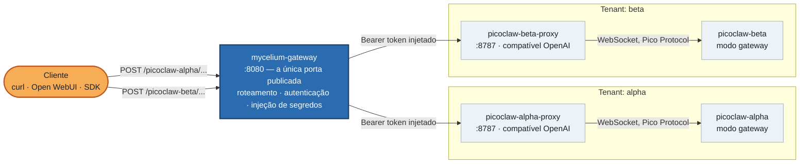

# zombie-crab-project

**Rode mais de um agente de IA pessoal, com segurança, atrás de uma única porta de entrada.**

*[Read this in English](./README.md)*

## O problema

O [PicoClaw](https://github.com/sipeed/picoclaw) é um assistente de IA
pessoal ultra-leve e muito bem feito — um único binário em Go, fácil de
hospedar, com um protocolo de chat em tempo real nativo (o "Pico Protocol")
via WebSocket. Mas ele foi desenhado em torno de uma ideia só: **um agente,
um dono**. Não existe conceito de papéis (roles), permissões ou controle de
acesso entre diferentes consumidores da mesma instância. Se você sobe um
gateway PicoClaw, *qualquer um que alcançar aquele endereço consegue
conversar com ele* — não existe um jeito nativo de dizer "essa API key só
pode chamar o agente do time de vendas" ou "esse time só pode ler, não
escrever".

Isso é ótimo se você está rodando o PicoClaw só pra você, na sua própria
máquina. Deixa de ser ótimo no momento em que você quer:

- Rodar **mais de uma** instância do PicoClaw (uma por time, cliente ou
  projeto) no mesmo host, e
- Expor elas por uma API HTTP normal (pra que qualquer client
  OpenAI-compatible — Open WebUI, LangChain, o SDK oficial da OpenAI —
  consiga conversar com elas), garantindo ao mesmo tempo que
- Cada instância só seja alcançável através de **um único ponto de entrada
  controlado e autenticado**, não cinco portas diferentes espalhadas pelas
  suas regras de firewall.

O PicoClaw, sozinho, não tem resposta pra essa última parte. Este projeto é
a peça que faltava.

## A ideia

Em vez de ensinar o PicoClaw a fazer algo pra que ele nunca foi desenhado,
colocamos um **API gateway** de verdade na frente dele — um que já sabe
fazer RBAC, gerenciar segredos e rotear requisições — e deixamos o PicoClaw
fazendo só o que ele faz bem.



Toda seta que entra num subgrafo de tenant passa primeiro pelo
`mycelium-gateway` — não existe outra porta de entrada.

Três peças, cada uma com um trabalho só:

| Peça | Trabalho |
|---|---|
| [**PicoClaw**](https://github.com/sipeed/picoclaw) (`picoclaw-alpha`, `picoclaw-beta`, ...) | O agente de verdade. Uma instância por tenant/time/caso de uso. Só fala o Pico Protocol nativo, via WebSocket. |
| [**picoclaw-openai-proxy**](https://github.com/sgelias/picoclaw-openai-proxy) | Um sidecar pequeno que traduz uma chamada HTTP `/v1/chat/completions` no formato OpenAI padrão pra um turno via WebSocket no Pico Protocol, pra que qualquer ferramenta compatível com OpenAI consiga falar com o PicoClaw. |
| [**Mycelium**](https://github.com/LepistaBioinformatics/mycelium) (modo standalone) | O API gateway. A *única* coisa exposta pro mundo externo. Tudo que está atrás dele é inalcançável exceto através dele. |

Nenhuma das instâncias do PicoClaw ou dos sidecars de proxy publica porta
pro host — elas só existem dentro de uma rede Docker privada. Se você não
está falando através do Mycelium, você não está falando com nada.

## Por que o Mycelium especificamente

Essa é a parte que realmente resolve o problema "o PicoClaw não tem RBAC" —
não adicionando RBAC ao PicoClaw, mas colocando na frente dele algo que já
tem:

- **Zero dependência pra começar.** O modo `standalone` do Mycelium roda em
  cima de SQLite e um cache em processo — sem precisar subir Postgres,
  Redis ou Vault antes. Você tem um API gateway de verdade com um único
  `docker compose up`.
- **Segredos nunca chegam ao cliente.** Cada rota downstream pode exigir um
  segredo (no nosso caso, um bearer token) que o Mycelium injeta no caminho
  até o proxy. Quem chama o gateway nunca vê esse valor, e o próprio proxy
  rejeita qualquer coisa que não carregue ele — então mesmo uma requisição
  perdida que de alguma forma chegasse direto na rede interna seria barrada.
- **Grupos de segurança, nativos.** Rotas no Mycelium podem ser `public`,
  `authenticated`, `protected` ou `protectedByRoles` (com permissões de
  leitura/escrita por papel). As rotas deste projeto são `authenticated`: o
  Mycelium valida o token do chamador e injeta o email verificado num header
  `x-mycelium-email` — o proxy lê isso e deriva a chave de sessão do
  PicoClaw a partir dele, nunca de um campo declarado pelo cliente. Ninguém
  mais consegue simplesmente colocar `"user": "outra-pessoa"` no corpo da
  requisição e ler a conversa de outra pessoa — **sem nunca precisar tocar
  no PicoClaw.** É o RBAC que o PicoClaw não tem, vivendo na camada que
  deveria ter. (`protected`/`protectedByRoles` — profile completo da conta,
  restrição de papel por instância — estão a uma linha de config de
  distância, mas exigem um modelo de contas/tenants que essa stack ainda não
  configura; veja "Entre pelo navegador em vez do curl" abaixo.)
- **Um lugar só pra olhar, um lugar só pra travar.** Health checks,
  roteamento, autenticação e rate limiting de *todas* as instâncias do
  PicoClaw vivem em um arquivo de config e um container só, em vez de
  serem reinventados a cada instância.
- **Escala de lado de graça.** Adicionar uma terceira, quarta ou décima
  instância do PicoClaw é copiar e colar: um novo par de serviços no
  `docker-compose.yaml` e um novo bloco de rota na config do Mycelium. O
  gateway não liga pra quantos agentes estão atrás dele.

## Um passo a passo pra quem está vendo isso pela primeira vez

Se você nunca mexeu com PicoClaw ou Mycelium antes, esse é o caminho do
zero até uma requisição funcionando:

**1. Clone, com o submódulo:**

```bash
git clone --recurse-submodules https://github.com/sgelias/zombie-crab-project.git
cd zombie-crab-project
```

**2. Faça o onboarding de cada instância do PicoClaw uma vez.** O primeiro
boot precisa gerar um `config.json` — faça isso antes do serviço
de longa duração (`gateway`) subir, senão ele entra em crash-loop com uma
config vazia:

```bash
docker compose run --rm picoclaw-alpha
docker compose run --rm picoclaw-beta
```

**3. Escolha um modelo e coloque sua API key de verdade.** Edite
`data/alpha/config.json` e defina `agents.defaults.provider` /
`agents.defaults.model_name` como uma das entradas já listadas no
`model_list` desse mesmo arquivo (DeepSeek, Anthropic, OpenAI e mais umas
duas dezenas de outros já vêm pré-preenchidos). Depois crie
`data/alpha/.security.yml` com a chave real:

```yaml
model_list:
  deepseek-chat:
    api_keys:
      - "sua-api-key-real"
```

**4. Ligue o canal que o proxy usa pra conversar.** Ainda em
`data/alpha/config.json`, defina `channel_list.pico.enabled` como `true`.
Depois dê um token pra ele em `.security.yml` — repare que ele precisa ficar
**aninhado** dentro de `settings`, não solto:

```yaml
channels:
  pico:
    settings:
      token: "um-token-aleatorio"
```

Repita os passos 3–4 para `data/beta/`.

**5. Avise o Mycelium sobre esses mesmos tokens.** Copie `.env.example`
para `.env` e defina `MYC_PICOCLAW_ALPHA_TOKEN` / `MYC_PICOCLAW_BETA_TOKEN`
— são os bearer tokens que o Mycelium vai injetar ao chamar cada proxy, e a
própria checagem `PROXY_API_KEY` do proxy espera exatamente o mesmo valor.

**6. Suba tudo:**

```bash
docker compose up -d
```

**7. Consiga uma conta no Mycelium e um bearer token.** As rotas são
`authenticated`, então um `curl` anônimo não passa mais pelo gateway — você
precisa de uma conta real no Mycelium e do token emitido por ela. Caminho
mais fácil: use o `chat-webapp` (veja "Entre pelo navegador em vez do curl"
abaixo) pra se cadastrar e pegar o token do cookie de sessão, ou siga o
[guia de fluxos de autenticação](https://github.com/LepistaBioinformatics/mycelium/blob/main/modules/mycelium-api-gateway/docs/book/src/11-authentication-flows.md)
do próprio Mycelium pra se registrar e logar direto contra esse mesmo
`mycelium-gateway`.

**8. Converse com ele — através do gateway, na única porta publicada:**

```bash
curl http://localhost:8080/picoclaw-alpha/v1/chat/completions \
  -H "Content-Type: application/json" \
  -H "Authorization: Bearer <seu-token-mycelium>" \
  -d '{
    "model": "picoclaw",
    "session_id": "conversa-1",
    "messages": [{"role": "user", "content": "oi"}]
  }'
```

Não tem mais campo `"user"` — o Mycelium resolve quem você é a partir do
token e injeta isso; o proxy confia nesse dado, não em nada do corpo.
Troque `picoclaw-alpha` por `picoclaw-beta` pra alcançar a segunda
instância — mesmo gateway, mesma porta, agente completamente separado por
baixo.

## Entre pelo navegador em vez do curl

Existem mais dois serviços só para que um humano não precise construir
requisições curl e tokens na mão:

- **`chat-webapp`** (`http://localhost:${CHAT_WEBAPP_PORT:-3000}`) — um
  pequeno cliente de teste em Next.js. Entre só com seu email (fluxo de
  magic link do Mycelium, sem senha), escolha `alpha` ou `beta`, e comece a
  conversar na hora — sem nenhuma configuração extra. É um BFF: seu
  navegador nunca vê o JWT do Mycelium, só um cookie de sessão httpOnly —
  toda chamada ao Mycelium acontece do lado do servidor, dentro do próprio
  container do `chat-webapp`.
- **`mycelium-webapp`** (`http://localhost:${MYCELIUM_WEBAPP_PORT:-8081}`) —
  a própria interface de administração oficial do Mycelium, construída a
  partir do repositório upstream do mesmo jeito que o `mycelium-gateway`
  (commit fixo do git, sem copiar fonte local). Não é necessária pro fluxo
  de chat acima; está aí pra quem quiser explorar as telas de administração
  de conta/tenant do próprio Mycelium.

**Nenhum SMTP real está configurado**, então os emails de magic link não são
realmente entregues — o build standalone do Mycelium só registra eles no
log. Depois de pedir um código:

```bash
docker compose logs mycelium-gateway | grep -o 'http://localhost:8080/_adm/beginners/users/magic-link/display[^"]*'
```

Abra essa URL num navegador; ela mostra o código de 6 dígitos pra digitar de
volta no `chat-webapp`.

### Por que toda conta recém-cadastrada já consegue conversar com as duas instâncias

As rotas aqui são `authenticated`, não `protected`/`protectedByRoles` — de
propósito. O modelo de contas do Mycelium exige que o chamador tenha um
vínculo de convidado (guest) numa conta de subscription vinculada a um
tenant só pra conseguir montar um profile completo (o mecanismo que tanto
`protected` quanto `protectedByRoles` usam) — uma conta recém-registrada não
tem nenhum, e seria rejeitada de cara, independente de qual papel específico
uma rota pedisse. Construir essa cadeia inteira (Staff → tenant →
subscription → convite de guest, mais migrar esse gateway de SQLite pra
Postgres, já que o CLI de seed de contas do Mycelium só funciona com
Postgres) é trabalho de configuração de verdade, deliberadamente adiado:
essa stack prioriza "entrar e conversar imediatamente" em vez de "restrição
de papel por instância" por enquanto. Restringir o `picoclaw-alpha` a
algumas contas e o `picoclaw-beta` a outras é um recurso real que esse mesmo
gateway suporta (`protectedByRoles`) — só que ainda não configurado neste
repositório.

## O que é o quê neste repositório

```
docker-compose.yaml       # a stack inteira: 2x pares picoclaw + proxy + gateway + webapps
.env.example              # parâmetros de runtime + bearer tokens por instância
mycelium/
  Dockerfile.standalone   # builda o mycelium-api a partir do git upstream, sem copiar fonte local
  config.standalone.toml  # rotas do gateway para picoclaw-alpha / picoclaw-beta
picoclaw-openai-proxy/    # submódulo git -- o sidecar compatível com OpenAI
webapp/                   # cliente de teste de chat em Next.js (BFF -- login, seletor, chat)
mycelium-webapp/          # Dockerfile da interface de admin do próprio Mycelium, buildada do git upstream
```

## Antes de levar isso pra produção

Este repositório é ajustado pra ser fácil de ler e fácil de rodar
localmente, não pra ser um deployment de produção já pronto e endurecido.
Algumas coisas que vale saber antes de expor isso além da sua própria
máquina:

- TLS está desabilitado entre o gateway e os serviços downstream (todos
  vivem numa rede Docker privada) — termine TLS na borda se a porta do
  `mycelium-gateway` algum dia encarar a internet. O cookie de sessão do
  próprio `chat-webapp` propositalmente não é marcado `Secure` pelo mesmo
  motivo (essa stack inteira é HTTP puro) — reative isso quando colocar TLS
  na frente dele.
- Rotacione os bearer tokens em `.env` e `.security.yml` antes de
  compartilhar essa stack com alguém, e nunca commite valores reais (os
  dois já estão no gitignore).
