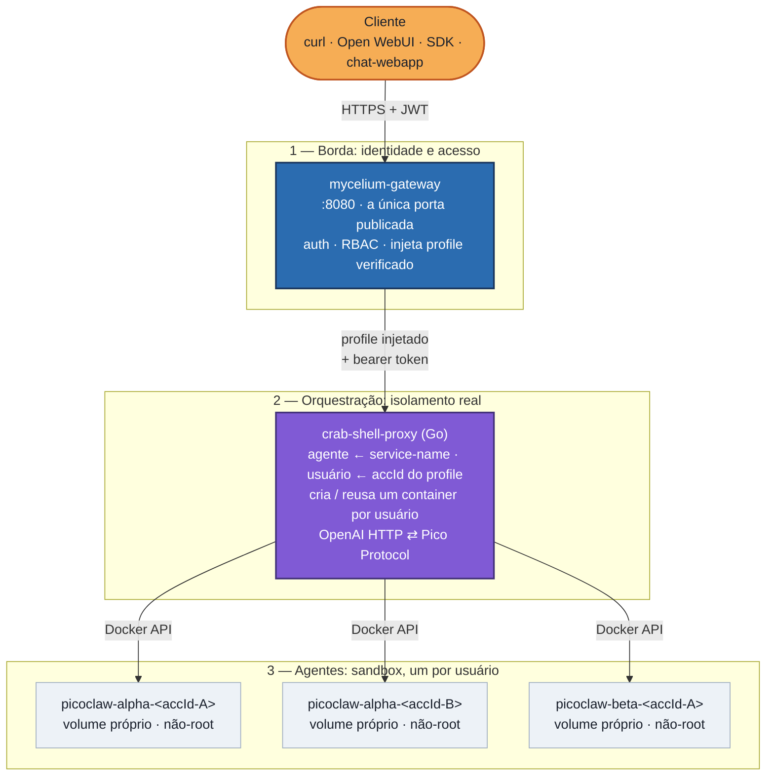

# zombie-crab-project

**Dê a cada usuário o seu próprio agente de IA real e isolado — atrás de uma única porta de entrada autenticada.**

*[Read this in English](./README.md)*

## O problema

O [PicoClaw](https://github.com/sipeed/picoclaw) é um assistente pessoal de IA
ultraleve e excelente — um único binário Go, fácil de auto-hospedar, com um
protocolo de chat em tempo real nativo ("Pico Protocol") sobre WebSocket. Mas
ele foi desenhado em torno de uma ideia: **um agente, um dono**. Não há conceito
de papéis, permissões ou isolamento entre diferentes consumidores do mesmo
deployment. Se você sobe um gateway PicoClaw, *qualquer um que o alcança pode
conversar com ele*, e todos que o fazem **compartilham o mesmo processo, o mesmo
sistema de arquivos e a mesma memória**.

Isso está ótimo no seu laptop. Deixa de estar no instante em que há mais de uma
pessoa envolvida, porque um agente de IA lê e escreve arquivos, roda
ferramentas, executa código e mantém memória de longo prazo — tudo guiado por
linguagem natural não-confiável. Num processo compartilhado, um único
prompt-injection, um bug de path-traversal ou uma ferramenta vazada bastam para
**um usuário ler as conversas, arquivos e segredos de outro**.

Então há, na verdade, dois problemas a resolver de uma vez:

1. **Acesso** — expor o PicoClaw por uma API HTTP normal e autenticada (para que
   qualquer cliente compatível com OpenAI possa usá-lo) através de **um ponto de
   entrada controlado**, e não de várias portas espalhadas pelo firewall.
2. **Isolamento** — fazer do agente de cada usuário uma fronteira *real*, de modo
   que o comprometimento de um nunca se torne o comprometimento de todos.

O PicoClaw não responde a nenhum dos dois sozinho. Este projeto é a estrutura
que falta ao redor dele.

## A estrutura (e por que ela tem esse formato)

Em vez de enfiar multi-tenancy no PicoClaw, a stack é composta por **três
camadas, cada uma fazendo exatamente um trabalho** — uma separação deliberada que
é o cerne do projeto:


```mermaid
flowchart TB
    client(["Cliente<br/>curl · Open WebUI · SDK · chat-webapp"])

    subgraph edge [1 — Borda: identidade e acesso]
        myc["mycelium-gateway<br/>:8080 · a única porta publicada<br/>auth · RBAC · injeta profile verificado"]
    end

    subgraph orch [2 — Orquestração: isolamento real]
        crab["crab-shell-proxy (Go)<br/>agente ← service-name · usuário ← accId do profile<br/>cria / reusa um container por usuário<br/>OpenAI HTTP ⇄ Pico Protocol"]
    end

    subgraph agents [3 — Agentes: sandbox, um por usuário]
        direction LR
        u1["picoclaw-alpha-&lt;accId-A&gt;<br/>volume próprio · não-root"]
        u2["picoclaw-alpha-&lt;accId-B&gt;<br/>volume próprio · não-root"]
        u3["picoclaw-beta-&lt;accId-A&gt;<br/>volume próprio · não-root"]
    end

    client -->|HTTPS + JWT| myc
    myc -->|profile injetado<br/>+ bearer token| crab
    crab -->|Docker API| u1
    crab -->|Docker API| u2
    crab -->|Docker API| u3

    classDef gateway fill:#2b6cb0,color:#fff,stroke:#1a365d,stroke-width:2px;
    classDef orchStyle fill:#805ad5,color:#fff,stroke:#44337a,stroke-width:2px;
    classDef clientStyle fill:#f6ad55,color:#1a202c,stroke:#c05621,stroke-width:2px;
    classDef agentStyle fill:#edf2f7,stroke:#a0aec0,color:#1a202c;
    class myc gateway;
    class crab orchStyle;
    class client clientStyle;
    class u1,u2,u3 agentStyle;
```

| Camada | Componente | Seu único trabalho |
|---|---|---|
| **1 · Borda** | [**Mycelium**](https://github.com/LepistaBioinformatics/mycelium) (standalone) | A única coisa exposta. Autentica o chamador, aplica RBAC e injeta um profile de conta **verificado e infalsificável** na requisição. Nada abaixo dele é alcançável exceto através dele. |
| **2 · Orquestração** | [**crab-shell-proxy**](https://github.com/LepistaBioinformatics/crab-shell-proxy) (Go) | Lê o agente do service-name injetado e o usuário do `accId` do profile, então garante que o container PicoClaw daquele usuário esteja no ar — subindo sob demanda, derrubando quando ocioso. Fala OpenAI HTTP para fora e Pico Protocol para dentro. |
| **3 · Agente** | [**PicoClaw**](https://github.com/sipeed/picoclaw) | O assistente em si, um **container isolado e não-root por `(agente, usuário)`**, com volume próprio para workspace, memória e sessões. |

**Por que essa separação importa — é defesa em profundidade, e o isolamento é real:**

- **A borda nunca confia na palavra do cliente sobre *quem* ele é.** O Mycelium
  verifica o token e injeta o profile no servidor; o chamador não consegue se
  passar por outro. A identidade flui *de cima para baixo*, de uma fonte
  confiável — nunca *de baixo para cima*, do corpo da requisição.
- **O isolamento é imposto pelo kernel, não por código de aplicação.** Cada
  usuário ganha um container separado (namespaces de processo, rede e mount) e um
  volume separado — não uma visão filtrada de um store compartilhado. Se o agente
  do usuário A for totalmente comprometido (prompt-injectado a rodar código
  hostil, por exemplo), ele ainda **não consegue ler os arquivos, a memória ou as
  conversas do usuário B**: container diferente, volume diferente, não-root, sem
  superfície compartilhada. Essa é a diferença entre *"isolado"* e isolado de
  verdade.
- **A identidade é a conta, não o e-mail.** Os usuários são chaveados pelo
  `accId` do profile (id de conta estável e único) — e-mails são mutáveis e são
  guardados apenas como marcador legível para operadores. Troque de e-mail; seu
  agente e seu histórico continuam seus.
- **Cada camada é substituível e auditável isoladamente.** Auth/RBAC vive na
  config de um gateway; isolamento e ciclo de vida vivem num pequeno serviço Go;
  o agente continua o binário PicoClaw padrão, sem modificações. Um lugar para
  raciocinar sobre cada preocupação.

### Ciclo de vida: scale-to-zero e contínuo

Containers por-usuário não rodam para sempre. Cada agente é configurado em um de
dois modos:

- **scale-to-zero** — o container faz cold-start no primeiro request do usuário e
  é desligado após uma janela de ociosidade configurável (dados preservados),
  liberando RAM. Ideal para uso só-API.
- **contínuo** — nunca é desligado automaticamente. Necessário quando o agente
  também é acessado pelos **connectors nativos** do PicoClaw (Telegram, MS
  Teams, …), que discam *para fora* de dentro do container e não passam pelo
  proxy — então o proxy não enxerga essa atividade para mantê-lo vivo.

## Passo a passo (primeira vez)

Do zero a um agente isolado funcionando:

**1. Clone, com submódulos:**

```bash
git clone --recurse-submodules https://github.com/LepistaBioinformatics/zombie-crab-project.git
cd zombie-crab-project
```

**2. (Opcional) Pré-semeie um template por agente.** Você pode pular — o proxy
faz **auto-bootstrap** de um template picoclaw default na primeira vez que um
usuário conversa, caso `data/templates/<agente>/` não exista; então um checkout
novo já funciona. Pré-semeie só quando quiser uma **persona/skills customizadas**
desde o início:

```bash
for a in alpha beta; do
  mkdir -p "data/templates/$a"
  docker run --rm -v "$PWD/data/templates/$a":/root/.picoclaw \
    docker.io/sipeed/picoclaw:latest >/dev/null 2>&1 || true
done
```

O crab-shell-proxy clona o template (o seu ou o default embutido) no dir de cada
novo usuário e injeta o provider/model, um token de canal pico novo e a chave de
API no provisionamento — então o template continua um scaffold cru e sem
segredos. Veja [Criando um Agente Customizado](./docs/CREATE_CUSTOM_AGENT.pt-br.md)
para moldar um template, e [Rodando e resetando do zero](#rodando-e-resetando-do-zero)
para o comportamento de auto-recuperação.

**3. Configure o `.env`.** Copie o `deploy/<modo>/.env.example` correspondente (standalone / prod / dokploy — veja [Modos de deploy](#modos-de-deploy)) para `.env` na raiz do repositório e defina:

- `MYC_PICOCLAW_ALPHA_TOKEN` / `MYC_PICOCLAW_BETA_TOKEN` / `MYC_HERMES_GLM_TOKEN`
  — bearer tokens que o Mycelium injeta e o crab-shell-proxy valida por agente.
- `PICOCLAW_ALPHA_API_KEY` / `PICOCLAW_BETA_API_KEY` / `PROXY_GLM_API_KEY` — a
  chave LLM **própria** de cada agente, lida do ambiente (nunca guardada em
  config ou imagem).
- `MYC_STANDALONE_BOOTSTRAP_SECRET` — libera o bootstrap único de Staff.

A stack traz três agentes: `alpha` e `beta` (picoclaw) e `hermes-glm` (uma
instância do hermes-agent, da Nous Research, conduzida pelo servidor
OpenAI-compatível dele em vez do Pico Protocol). Um agente cujo token ou chave de
provider esteja vazio é auto-desabilitado pelo proxy no startup, então dá para
rodar só os que você tem chave.

Qual provider/model cada agente usa é declarado em
[`crab/crab-shell-proxy/config.yaml`](./crab/crab-shell-proxy/config.yaml) (ex.:
`deepseek` / `deepseek-chat`), apontando para o env var acima.

**4. Suba tudo:**

```bash
docker compose up -d --build
```

**5. Reivindique a conta Staff (uma vez).** Abra
`http://localhost:${MYCELIUM_PORT:-8080}/_adm/instance/bootstrap`, envie o
bootstrap secret + seu e-mail, e leia o código de 6 dígitos no log do gateway (o
modo standalone loga os e-mails de magic-link em vez de enviá-los):

```bash
docker compose logs mycelium-gateway | grep -i bootstrap
```

**6. Entre e converse.** Abra o **`chat-webapp`**
(`http://localhost:${CHAT_WEBAPP_PORT:-3000}`), entre com seu e-mail
(magic-link, sem senha), escolha um agente e converse. Sua primeira mensagem faz
o cold-start do *seu próprio* container; o `docker ps` mostrará
`crabshell-alpha-<hash>` rodando como usuário não-root (o hash é a tripla
tenant + subscription + conta — nome de container tem limite de 63 caracteres,
então a identidade fica nas labels, não no nome).

> As rotas do gateway são `protectedByRoles` (papéis `alpha` / `beta` /
> `hermes-glm`), então uma conta precisa ter o guest-role correspondente para
> alcançar uma instância. Os papéis podem ser concedidos pela **área de admin do
> chat-webapp** (Membros → convidar) ou pelo **`mycelium-webapp`**
> (`http://localhost:${MYCELIUM_WEBAPP_PORT:-8081}`) — a UI de admin do próprio
> Mycelium — via o fluxo Staff → tenant → subscription → guest-invite.

## Rodando e resetando do zero

O passo-a-passo acima sobe uma stack limpa. Para **resetar um ambiente
existente do zero** — apagar todo agente por-usuário e todos os templates, e
deixar a stack se reconstruir — derrube a stack, remova os containers que o
proxy criou, apague o estado em disco e rebuilde:

```bash
docker compose down
docker rm -f $(docker ps -aq --filter 'name=crabshell') 2>/dev/null   # agentes criados fora do compose

# o estado em disco pertence aos agentes (não-root) spawnados -> sudo
sudo rm -rf data/templates data/tenants data/effective-secrets \
            data/effective-skills data/user-secrets data/registered-models

docker compose up -d --build   # --build é OBRIGATÓRIO: o template de fallback é embutido no binário do proxy
```

Depois logue e mande uma mensagem — o proxy re-provisiona seu usuário do zero.
Contas e papéis ficam nos volumes nomeados, **não** em `data/`, então não são
apagados: no standalone isso é o `mycelium-data` (o banco SQLite do Mycelium),
mais o `chat-webapp-postgres-data` da lista de conversas. Seu login sobrevive;
adicione `-v` ao `docker compose down` só se quiser resetar contas também (aí
você refaz o bootstrap de Staff).

**Por que não é preciso recuperação manual:** o proxy faz **auto-bootstrap** de
um `data/templates/<agente>/` ausente a partir de um template default **embutido
no binário**, então um `data/` apagado se recupera sozinho no próximo chat — sem
`picoclaw onboard`. O modelo e a chave por-agente são reaplicados do
`config.yaml` + `.env` em todo provisionamento, então o agente também volta a
responder na hora. Para customizar o default embutido, edite
`crab/crab-shell-proxy/internal/docker/defaulttemplate/<harness>/` (hoje:
`picoclaw`) e rebuilde.

## Modos de deploy

Três perfis convivem lado a lado. Cada um tem um diretório em `deploy/` com o seu
`.env.example` e a config do gateway que aquele modo monta — copie o
`.env.example` correspondente para `.env` na raiz e use o comando de compose do
modo.

| | **standalone** (padrão) | **prod** | **dokploy** |
|---|---|---|---|
| Compose | `docker compose up -d` | `docker compose -f docker-compose.yaml -f docker-compose.prod.yaml up -d` | `docker compose -f docker-compose.dokploy.yaml up -d` (ou aponte o Dokploy para este repo + arquivo) |
| Mycelium | buildado do fonte (`MYCELIUM_GIT_REF`) | imagem publicada (`MYCELIUM_IMAGE_TAG`) | imagem publicada (`MYCELIUM_IMAGE_TAG`) |
| Armazenamento | SQLite no `mycelium-data` | `mycelium-postgres` | `mycelium-postgres` |
| E-mail | stub — os magic-links caem no log | SMTP real | SMTP real |
| Entrada | portas publicadas no host | portas publicadas no host | Traefik, um domínio por serviço |
| Agentes | alpha · beta · hermes-glm | alpha · beta · hermes-glm | alpha · beta |
| Config do gateway | `deploy/standalone/config.standalone.toml` | `deploy/prod/config.base.toml` | `deploy/dokploy/config.base.toml` |
| Catálogo de agentes | embutido na imagem do proxy | embutido na imagem do proxy | montado: `deploy/dokploy/crab-shell-proxy.config.yaml` |

Os três fixam a **mesma release do Mycelium**: o standalone builda o commit da
tag `9.0.0-rc.13`, prod e dokploy puxam `MYCELIUM_IMAGE_TAG=9.0.0-rc.13`. Mova
todos juntos — a config do gateway é vocabulário compartilhado, e uma diferença
de versão entre o que você testa e o que sobe é exatamente onde quebra.

### Schema do banco, uma vez só (prod e dokploy)

O backend Postgres **não tem migrations embutidas** (o SQLite tem), então o
schema precisa ser aplicado uma vez, depois do primeiro `up`. São **dois
passos**: o `up.sql` do upstream e, depois, os scripts de migration que o
`up.sql` *não* incorpora. Pegue os dois do repo do mycelium na tag que este
deploy fixa:

```bash
git clone --depth 1 --branch 9.0.0-rc.13 \
  https://github.com/LepistaBioinformatics/mycelium.git /tmp/myc
cd /caminho/para/zombie-crab-project && set -a; . ./.env; set +a

# 1) schema base
docker compose -f docker-compose.yaml -f docker-compose.prod.yaml exec -T mycelium-postgres \
  psql -U "$MYC_DB_USER" -d postgres \
       -v db_name="$MYC_DB_NAME" -v db_user="$MYC_DB_USER" \
       -v db_password="$MYC_DB_PASSWORD" -v db_role=service-role-mycelium \
  < /tmp/myc/adapters/diesel_postgres/sql/up.sql

# 2) as migrations, na ordem dos nomes
for m in /tmp/myc/adapters/diesel_postgres/sql/migrations/*.sql; do
  docker compose -f docker-compose.yaml -f docker-compose.prod.yaml exec -T mycelium-postgres \
    psql -U "$MYC_DB_USER" -d "$MYC_DB_NAME" < "$m"
done
```

O passo 1 cria o banco se não existir, dá `\c` nele e então cria os roles e as
tabelas; ele **exige** o `-v db_password`. O compose já criou o banco **e** o
role de login, então `CREATE USER … already exists` é esperado e inofensivo — o
psql segue adiante.

O passo 2 não é opcional na `9.0.0-rc.13`: o `up.sql` dessa tag traz o
`kv_artifact` e o índice de claim do `message_queue`, mas **não** o
`instance_settings`, o `resource_audit_log` nem as colunas
`tenant.encrypted_dek` / `kek_version` (envelope encryption) — essas só existem
como migration. Confira com `\dt` (devem aparecer `instance_settings` e
`resource_audit_log`) e `\d tenant` (`encrypted_dek`, `kek_version`). No Dokploy,
rode os mesmos dois passos via `docker exec` no container `mycelium-postgres`.

### Antes de um deploy prod ou dokploy

- **`CRAB_HOST_DATA_ROOT`** — precisa ser um caminho absoluto **do host**. O
  crab-shell-proxy entrega esse caminho ao daemon Docker do host como origem do
  bind-mount dos containers de agente que ele cria, então um caminho de dentro do
  proxy não resolve.
- **prod / `deploy/prod/config.base.toml`** — ajuste `noreplyEmail` e
  `supportEmail` para o `MYC_SMTP_USERNAME` (o Gmail recusa um `From`
  divergente). `domainUrl` / `allowedOrigins` já vêm apontando para as origens
  localhost que esse modo realmente serve; se você colocar um hostname na frente,
  mude os dois **junto com** o build arg `VITE_MYCELIUM_API_URL` do
  `mycelium-webapp` — a UI de admin é uma SPA que chama o gateway direto do
  browser, então divergir é um muro de CORS.
- **dokploy / `deploy/dokploy/config.base.toml`** — troque as linhas
  `►►► REPLACE` pelas suas origens `https://` reais (têm que bater com
  `MYCELIUM_DOMAIN` e `MYCELIUM_WEBAPP_DOMAIN`), e lembre que a rede
  `dokploy-network` precisa já existir.
- **Catálogo de agentes** — o dokploy monta
  `deploy/dokploy/crab-shell-proxy.config.yaml`, então dá para adicionar ou
  remover agentes ali sem rebuildar a imagem do proxy. standalone e prod usam o
  catálogo embutido na imagem (`crab/crab-shell-proxy/config.yaml`).
- **Webhook de conta (opcional)** — registrar o webhook
  `subscriptionAccount.created` do mycelium faz o proxy montar a raiz de
  workspace da subscription na hora, em vez de no primeiro chat do membro. Via
  JSON-RPC (`POST /_adm/rpc`, token de Staff), método
  `systemManager.webhooks.create`: `{"name": "crab-shell-proxy", "url":
  "http://crab-shell-proxy:8080/v1/accounts", "trigger":
  "subscriptionAccount.created", "method": "POST", "secret":
  {"authorizationHeader": {"headerName": "Authorization", "prefix": "Bearer",
  "token": "<CRAB_WEBHOOK_SECRET>"}}}`.

## Administração dia-a-dia

Gerenciar modelos, skills compartilhadas, secrets compartilhados, arquivos,
personas, membros e branding é feito pela **área de admin do chat-webapp** —
veja o [Guia do Administrador](./docs/ADMIN_GUIDE.pt-br.md).

## O que há neste repositório

```
docker-compose.yaml        # a stack inteira, standalone/padrão (gateway + crab-shell-proxy + webapps + db)
docker-compose.prod.yaml   # overlay de prod: imagens publicadas + mycelium em modo Postgres (-f com o de cima)
docker-compose.dokploy.yaml# arquivo autocontido Traefik/Dokploy (base + prod + ingress já mesclados)
deploy/                    # configs por modo: exemplos de .env + configs do mycelium/proxy (standalone / prod / dokploy)
crab/                      # o lado crab (isolamento por-usuário + seu cliente de chat)
  crab-shell-proxy/        # submódulo git — o orquestrador Go de isolamento por-usuário
  crab-exoskeleton-webapp/ # submódulo git — o cliente de chat Next.js (BFF)
fungi/                     # o lado mycelium (gateway + sua UI de admin)
  mycelium/
    Dockerfile.standalone  # builda o mycelium-api do git upstream (sem fonte local)
  mycelium-webapp/         # Dockerfile da UI de admin do Mycelium (do git upstream)
docs/                      # guias de tarefas (criar um agente customizado · guia de admin)
data/                      # templates por-agente + volumes por-usuário + material compartilhado (gitignored)
  templates/<agente>/      #   template clonado em cada novo usuário (auto-bootstrap se ausente)
  tenants/…                #   volumes isolados por-(agente,usuário)
```

O `crab-shell-proxy` é um submódulo com seu próprio
[README](./crab/crab-shell-proxy/README.md) detalhando o modelo de isolamento.

A pasta [`docs/`](./docs/) reúne guias para tarefas comuns —
[**Criando um Agente Customizado**](./docs/CREATE_CUSTOM_AGENT.pt-br.md) e o
[**Guia do Administrador**](./docs/ADMIN_GUIDE.pt-br.md) (modelos, skills, secrets, membros).

## Antes de levar isto para produção

Ajustado para ser fácil de ler e rodar localmente, não endurecido de fábrica:

- **O crab-shell-proxy segura o socket do Docker** e roda como root — é o
  componente mais privilegiado (pode controlar o daemon do host) e é o
  control-plane confiável; os agentes que ele cria são a parte não-root e
  sandbox. Isole o socket (um socket-proxy restrito, um host dedicado) antes de
  expor isto.
- **TLS está desabilitado** entre o gateway e os downstreams na rede privada —
  termine TLS na borda se a porta do `mycelium-gateway` algum dia encarar a
  internet, e reative o cookie de sessão `Secure` do `chat-webapp`.
- **Rotacione os segredos** no `.env` (bearer tokens, chaves LLM, bootstrap
  secret) antes de compartilhar esta stack; os valores reais são gitignored —
  mantenha assim.
